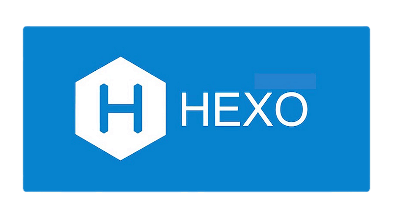

# Jekyll 정적 웹사이트 구축
{:width="300"}
{:width="300"}

Hexo로 운영했던 블로그를 Jekyll로 다시 이전합니다.
Hexo 역시 관리하기 편리했지만, Hexo 버전과 테마의 버전이 변경될 때 마다 자잘한 오류로 인해 스트레스 만땅이기에 다시 Jekyll로 돌아가기로 결정했습니다.

[Jekyll 웹사이트](https://jekyllrb-ko.github.io)

[Hydejack 테마](https://hydejack.com)