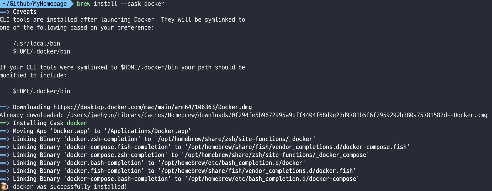
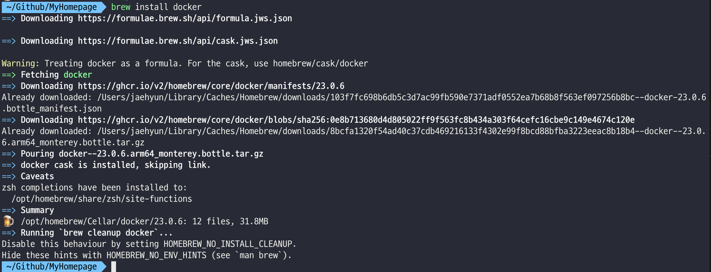
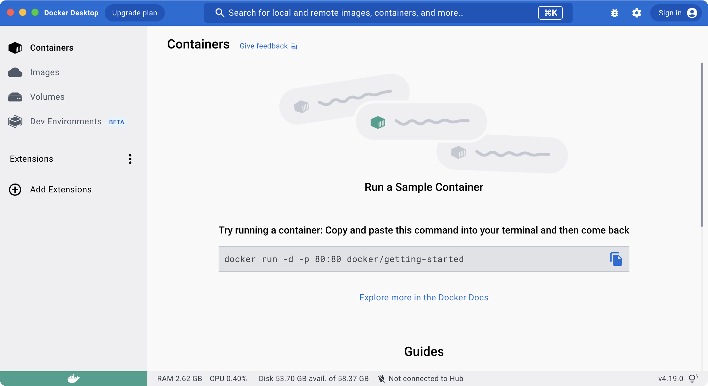

{:width="600"}

## Docker 설치

- Docker Server 설치
 
```sh
brew install --cask docker
```



- Docker Client 설치

```sh
brew install docker
```



도커 서버를 실행한다.



### Jekyll 이미지 다운로드

```sh
docker pull jekyll/jekyll
```

### Jekyll 이미지 실행

```sh
docker run --rm -it --platform=linux/amd64/v8 jekyll/jekyll
```