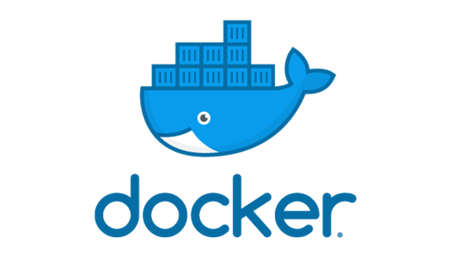
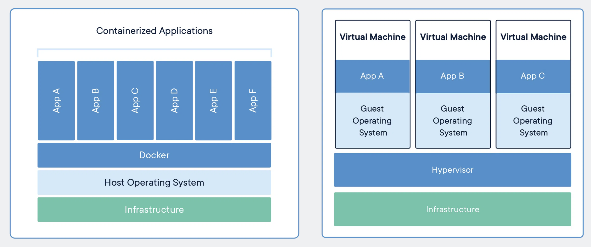
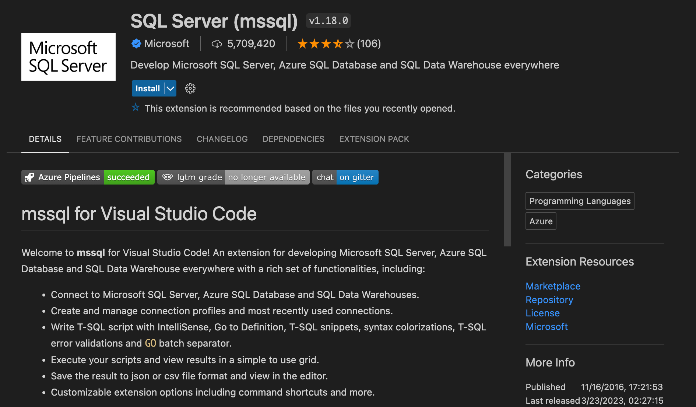
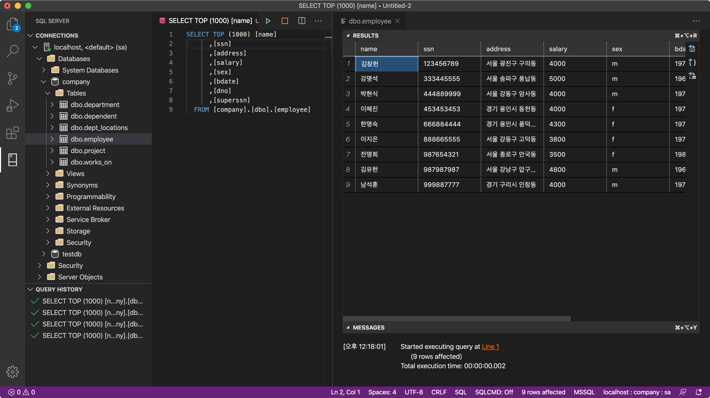

{:width="400"}

## 도커(Docker) 란?

>도커(Docker)는 리눅스의 응용 프로그램들을 소프트웨어 컨테이너 안에 배치시키는 일을 자동화하는 오픈 소스 프로젝트이다. [위키백과](https://ko.wikipedia.org/wiki/도커_(소프트웨어))


>도커 컨테이너는 일종의 소프트웨어를 소프트웨어의 실행에 필요한 모든 것을 포함하는 완전한 파일 시스템 안에 감싼다. 여기에는 코드, 런타임, 시스템 도구, 시스템 라이브러리 등 서버에 설치되는 무엇이든 아우른다. 이는 실행 중인 환경에 관계 없이 언제나 동일하게 실행될 것을 보증한다. [도커 홈페이지](https://www.docker.com/resources/what-container)

### 도커의 구조

도커(Docker)는 VirtualBox 또는 VMWare와 같은 일종의 가상머신(VMs)의 개념과 비슷하다. 하지만 기존의 가상머신은 게스트OS를 설치한 후 사용하는 방식이라 설치 시간도 많이 소모되며 별도의 운영체제를 구동하기 때문에 쾌적한 성능을 기대하기 어렵다. 반대로 도커는 게스트OS를 설치하지 않고 호스트OS의 자원을 적절히 공유해 사용하기 때문에 쾌적한 성능을 보인다.


출처: [https://www.docker.com/resources/what-container/](https://www.docker.com/resources/what-container/)
{:.figure}

### 도커 설치

homebrew를 사용해 설치하면 Docker와 [Docker Desktop on Mac](https://www.docker.com/products/docker-desktop)(docker-compose, docker-machine)이 같이 설치되기 때문에 편리하다.

```sh
$ brew install --cask docker
```

설치 후 Application 폴더에 Docker 아이콘이 생성되며 터미널에서 다음과 같이 버전을 확인할 수 있다.

```sh
$ docker version
Client: Docker Engine - Community
 Version:           19.03.8
 API version:       1.40
 Go version:        go1.12.17
 Git commit:        afacb8b
 Built:             Wed Mar 11 01:21:11 2020
 OS/Arch:           darwin/amd64
 Experimental:      false
```

### 도커의 주요 명령어

|기능|명령어|
|--|--|
|버전 확인	 |$ docker -v|
|이미지 다운로드	 |$ docker pull [이미지 명]|
|다운로드된 이미지 목록|$ docker images|
|이미지 삭제|$ docker rmi [이미지 id]|
|컨테이너 생성	 |$ docker create [옵션] [이미지 명]|
|컨테이너 생성 및 실행|$ docker run [옵션] [이미지 명]|
|컨테이너 실행	 |$ docker start [컨테이너 명]|
|컨테이너 재실행	 |$ docker restart [컨테이너 명]|
|컨테이너 접속	 |$ docker attach [컨테이너 명]|
|컨테이너 정지	 |$ docker stop [컨테이너 명]|
|실행중인 컨테이너 목록|$ docker ps|
|정지된 컨테이너 목록 |$ docker ps -a|
|컨테이너 명 변경	 |$ docker rename [기존 컨테이너 명] [새로운 컨테이너 명]|
|컨테이너 삭제	 |$ docker rm [컨테이너 명 or 컨테이너 id]|

---

## 도커를 활용한 MSSQL 설치 for MacOS

- 마이크로소프트 MSSQL 설치 가이드

[https://docs.microsoft.com/ko-kr/sql/linux/quickstart-install-connect-docker?view=sql-server-ver15&pivots=cs1-bash](https://docs.microsoft.com/ko-kr/sql/linux/quickstart-install-connect-docker?view=sql-server-ver15&pivots=cs1-bash)

- Docker 이미지 설치 및 설정
```sh
$ docker search mssql
$ docker pull microsoft/mssql-server-linux
```

- MSSQL용 컨테이너를 생성하고 실행한다.
```sh
$ docker run -e 'ACCEPT_EULA=Y' -e 'SA_PASSWORD=sa123456!' \
> -p 1433:1433 --name mssql_server \
> -d microsoft/mssql-server-linux
```

### Azure Data Studio 설치


[Azure Data Studio 소개 문서](https://docs.microsoft.com/ko-kr/sql/azure-data-studio/what-is?view=sql-server-ver15)

- Azure Data Studio는 DB Client로 Windows, Mac, Linux에서 무료로 사용할 수 있다. Homebrew를 이용해 다음과 같이 설치한다.

```sh
$ brew search azuredatastudio
==> Casks
azure-data-studio

$ brew install --cask azure-data-studio
```

### VSCode에서 확장팩을 사용해 MSSQL에 접속하기

- VSCode의 Extentions에서 MSSQL로 검색한 후 "SQL Server(mssql)"을 설치한다.


- [Microsoft 관련자료](https://docs.microsoft.com/ko-kr/sql/visual-studio-code/sql-server-develop-use-vscode?view=sql-server-ver15)


- DB 접속후 테이블을 검색한 예시화면


---

### 참고 블로그

[MSDN](https://docs.microsoft.com/ko-kr/sql/linux/quickstart-install-connect-docker?view=sql-server-ver15&pivots=cs1-bash)

[devssun님 블로그(https://hyesunzzang.tistory.com/91)](https://hyesunzzang.tistory.com/91)

[Mark님 블로그(https://dc7303.github.io/docker/2019/11/24/dockerInstallForMac/)](https://dc7303.github.io/docker/2019/11/24/dockerInstallForMac/)

[44BITS(https://www.44bits.io/ko/post/easy-deploy-with-docker)](https://www.44bits.io/ko/post/easy-deploy-with-docker)

[https://medium.com/@reverentgeek/sql-server-running-on-a-mac-3efafda48861](https://medium.com/@reverentgeek/sql-server-running-on-a-mac-3efafda48861)
