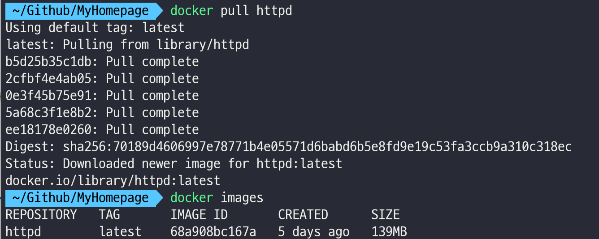

## Docker 기본 명령어

- 현재 설치된(다운로드된) Docker 이미지를 조회

```sh
docker images
```

### 이미지 가져오기
  - Docker Hub : Docker 이미지를 저장하는 웹서비스

```sh
docker pull httpd
docker images

```




- pull : 이미지를 다운로드


### 이미지 실행

- run : 이미지를 실행 -> 컨테이너가 실행

```sh
docker run {이미지명}
docker run --name {컨테이너명} {이미지명}
```

### 컨테이너 정지

```sh
docker stop {컨테이너명}
```

### 컨테이너 목록

```sh
docker ps #컨테이너
docker ps -a #모든 컨테이너 조회
```

#### 컨테이너 재시작

```sh
docker start {컨테이너명}
docker restart {컨테이너명}
```

### 컨테이너 삭제

```sh
docker rm {컨테이너명}
docker rm --force {컨테이너명}  # 실행중인 경우에도 강제 삭제할 경우

```

### 이미지 삭제

```sh
docker rmi {이미지명}

```