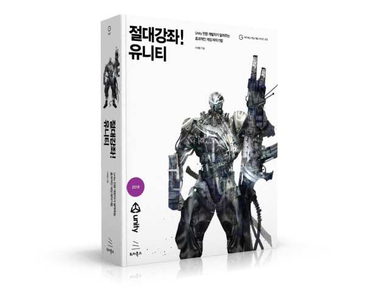

현재 **절대강좌! 유니티**는 개정판 준비로 인해 절판 상태입니다. 조만간 충실한 내용과 유니티 2020버전으로 다시 선보이겠습니다. 이전 책으로 공부하시는 분들의 질의/응답은 예전 게시판에서 조회하실 수 있습니다. 

- [구 질의/응답 게시판 조회하기](https://disqus.com/home/discussion/unity3dstudy/_unity3dstudy_1_70/newest/)

**절대강좌! 유니티**가 새롭게 출간됐습니다. 최신 유니티 2018 버전을 기준으로 전체를 새로 집필했습니다. 이전 출간본에서는 지면상 다루지 못했던 다양한 게임제작 기법 및 유니티 고급기법을 최대한 많이 수록하려 했습니다. 아쉽게도 기존의 네트워크 게임부분은 새로운 책으로 준비중에 있습니다. (그래도 책의 두께는 살짝 더 두꺼워 졌습니다.^^)

<!-- more -->

#### 책에서 사용하는 리소스 다운로드 ("절대강좌! 유니티" 2018-05 출간본)
* [절대강좌! 유니티 2018용 리소스 - 깃허브](https://github.com/IndieGameMaker/UnityBook)

* [절대강좌! 유니티 2018용 리소스 - 구글 드라이브](https://drive.google.com/drive/folders/10nL-pMibjLCmXRJgRNKLb1DQ8knS_Sb-)

* [챕터별 소스](https://github.com/IndieGameMaker/UnityBookSource)

---
* [절대강좌! 유니티5 용 리소스](https://github.com/IndieGameMaker/UnityBook5)

* [Unity 5 权威讲解Unity专业开发人员讲述高效游戏制作技巧！ - Resource Download](https://github.com/IndieGameMaker/UnityBook5)

#### 책 Q&A
현재 **절대강좌! 유니티**는 절판된 상태입니다. 개정판을 준비중입니다. 아래 링크는 과거 질의/응답 게시판입니다.
* [절대강좌 질의/응답](https://disqus.com/home/discussion/unity3dstudy/_unity3dstudy_1_70/newest/)

<!-- #### 책 오탈자

* [오탈자 조회 및 신고](../books-error) -->

#### 온라인 서점

* [예스24](http://www.yes24.com/24/goods/60507941)
* [인터파크](http://book.interpark.com/product/BookDisplay.do?_method=detail&sc.prdNo=283352333)
* [교보문고](http://www.kyobobook.co.kr/product/detailViewKor.laf?ejkGb=KOR&mallGb=KOR&barcode=9791158391058&orderClick=LET&Kc=)
* [알라딘](http://www.aladin.co.kr/shop/wproduct.aspx?ItemId=143152793)