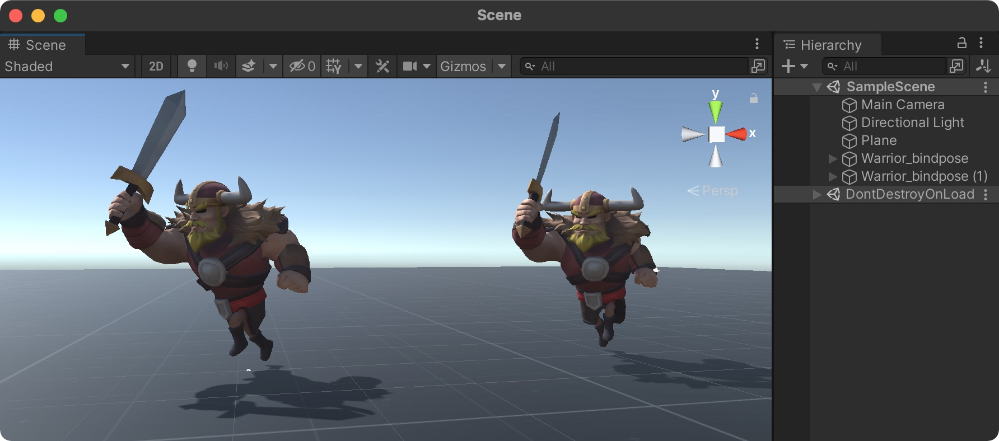
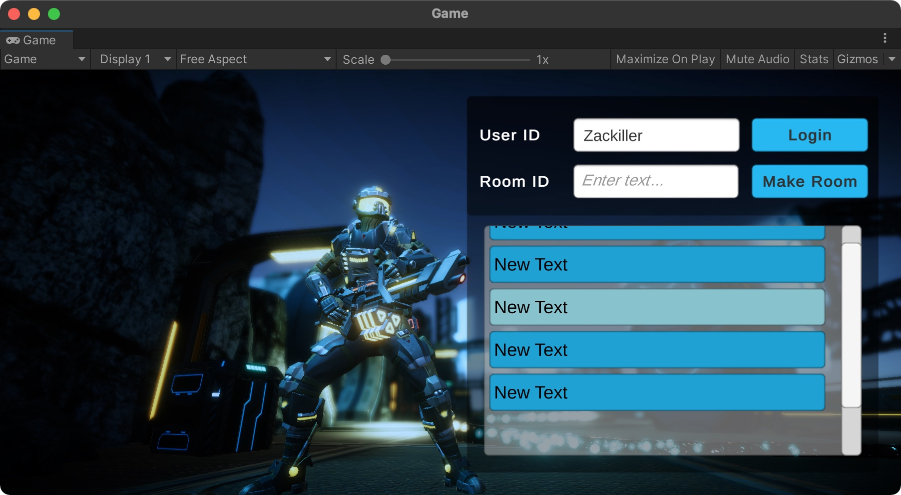
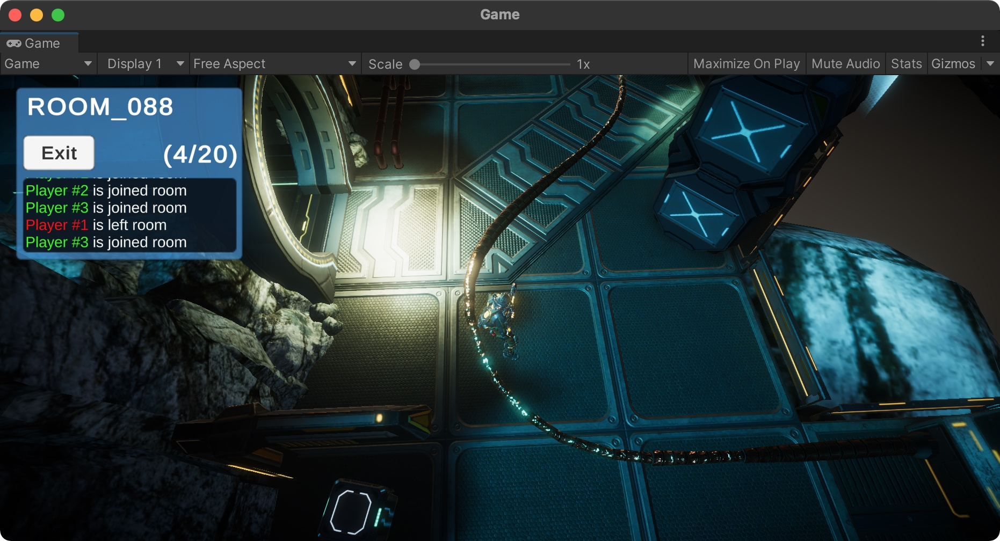

{:width="650"}

## 절대강좌! 유니티 (2021 버전)

**절대강좌! 유니티** 절판된지 무려 2년만에 개정판을 새롭게 출간했습니다. 2020 버전으로 집필을 시작해 최종 2021 버전으로 출간하게 됐습니다. 6년전 초판본에 수록되었던 포톤 네트워크와 유니버셜 랜더 파이프라인(URP), New Input System 내용도 새롭게 수록했습니다. 유니티를 시작하시는 분들께 적극 추천합니다.

<!-- more -->

#### 3인칭 슈팅 게임 제작

### 새로운 Input System

### 포톤 클라우드를 활용한 네트워크 게임 - 로비 제작

### 포톤 클라우드를 활용한 네트워크 게임 - 네트워크 동기화 및 룸 정보

#### 절대강좌! 유니티 2021 - 리소스 다운로드
* [책에서 사용하는 리소스](https://github.com/IndieGameMaker/UnityBook)
* [프로젝트 소스코드](https://github.com/IndieGameMaker/SpaceShooter2021)

#### 온라인 서점

* [예스24](http://www.yes24.com/Product/Goods/101976203?OzSrank=8)
* [인터파크](http://book.interpark.com/product/BookDisplay.do?_method=detail&sc.shopNo=0000400000&sc.prdNo=350692930&sc.saNo=003002001&bid1=search&bid2=product&bid3=title&bid4=001)
* [교보문고](http://www.kyobobook.co.kr/product/detailViewKor.laf?ejkGb=KOR&mallGb=KOR&barcode=9791158392611&orderClick=LAG&Kc=)
* [알라딘](https://www.aladin.co.kr/shop/wproduct.aspx?ItemId=272637400)

<noscript>Please enable JavaScript to view the <a href="https://disqus.com/?ref_noscript">comments powered by Disqus.</a></noscript>