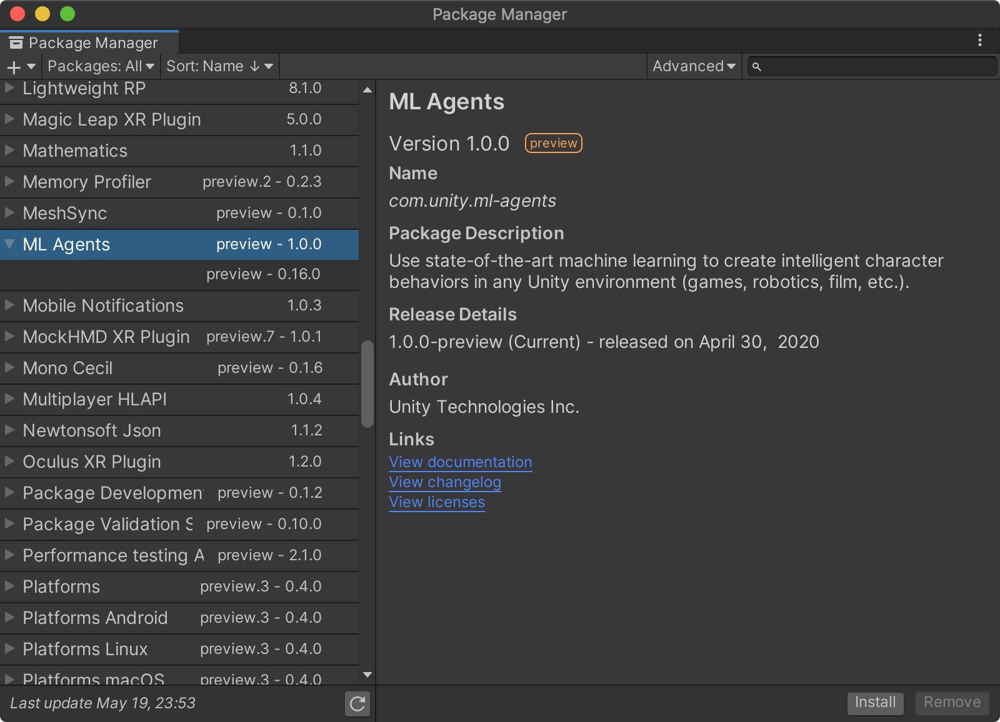

유니티 머신러닝 에이전트(줄여서 ML-Agents)는 머신러닝, 특히 강화학습을 위한 툴킷으로 2017년에 처음 소개됐으며 정식 버전(Release 1)은 2020-04-30에 출시됐다.(2020-05-12 정식발표) 여러 베타 버전을 거치면서 사용법이 초기 버전과는 많이 변경되어 ML-Agents를 공부하는 입장에서는 상당히 곤욕스러웠다. 

- [릴리즈 1의 자세한 발표내용](https://blogs.unity3d.com/2020/05/12/announcing-ml-agents-unity-package-v1-0/)

<!--more-->
0.10 이전과 이후 버전은 사용법이 많이 변경됐지만 좀 더 사용하기 편리하도록 개선되었다.

### 개선사항

- 깃허브 프로젝트를 통하지 않고 패키지 매니저를 통해 설치하도록 변경됨.
- 브레인(Brain) 에셋을 생성하지 않는다. Learning Brain, Player Brain, Heuristic Brain을 인스펙터 뷰와 코드에서 처리하도록 변경됨.
- 반복적인 입력을 요구하는 인터페이스의 개선됨, 특히 Vector Action/Space Type 설정 부분에서 일일이 Input Manager와 싱크를 맞추는 작업이 없어짐.
- 핵심 클래스를 가상화시켜 실제 구현시 주요 메소드를 상속(override)받아 편리하게 사용할 수 있도록 개선됨.(Code Intelisense 가능)
- Ray Perception Sensor 2D/3D의 방식이 스크립트 컴포넌트로 구현되어 레이(Ray)의 갯수와 방향, 오프셋(Offset)값, 컬링 마스크(Culling Mask)등을 쉽게 설정할 수 있음.

### 변경사항

- 네임스페이스가 MLAgents 에서 **Unity.MLAgents**로 변경됨.
- Agent.Heuristic() 메소드의 파라메터가 변경됨. 결괏값을 Array로 리턴하지 않는다.
- Agent 클래스의 주요 메소드인 GiveMode, Done, InitializeAgent, AgentAction, AgentReset은 삭제(Deprecated)됨
- Agent.maxStep 속성명이 Agent.MaxStep으로 변경됨.
- CLI에서의 \--train 플래그는 삭제됨. 즉, 지정하지 않아도 기본값이 훈련(Train)이다.
- 기존 훈련(학습)을 연이어 훈련할 때 사용했던 \--load 플래그가 \--resume으로 변경됨.

[자세한 릴리즈 노트](https://github.com/Unity-Technologies/ml-agents/releases/tag/release_1)

<!-- ## ML-Agents 란?

ML-Agents는 강화학습에 필수적인 요소인 환경(Environment)을 유니티로 구현하고(3D 환경), 그 환경속에서 학습하는 에이전트(Agent:학습자)의 행동(Action)과 보상(Reward)를 줄 수 있도록 구현할 수 있다. 또한, 텐서플로를 사용해 학습시키기 위해 python과의 통신을 담당한다.

 
-->

## ML-Agents 환경 및 설치 과정

맥OS에서의 설치 과정과 필수 환경은 다음과 같다.

- 유니티 (2018.4 or later)
- 파이썬 (3.6 or 3.7)
- mlagents Python 패키지 설치
- [ml-agents 리포지토리](https://github.com/Unity-Technologies/ml-agents.git) 클론
- 유니티 프로젝트에 ~~com.unity.ml-agents 패키지 설치~~ 패키지 매니저에서 ML-Agent를 설치


초기에는 [아나콘다(Anaconda)](https://www.anaconda.com)를 활용해 개발환경을 설정하는 예제나 자료가 많았지만 필자는 권장하지 않는다. 정식 배포판부터 아나콘다의 공식 지원이 중단됐다(deprecated). 

## mlagents 파이썬 패키지 설치

ML-Agents 파이썬 패키지 설치는 파이썬이 설치되지 않았다면 다음 6개 단계를 거친다. ([윈도우OS 설치과정](https://unity3dstudy.com/2020/08/20/MLAgents-Installation-for-WinOS/)) 이 과정에서 의존성이 있는 다양한 소프트웨어들이 설치되며, 텐서플로도 같이 설치된다.

```sh
$ brew install python@3.8
$ git clone --branch release_1 https://github.com/Unity-Technologies/ml-agents.git
$ cd ml-agents

$ sudo pip3 install setuptools --upgrade
$ sudo pip3 install -e ./ml-agents-envs
$ sudo pip3 install -e ./ml-agnets
```

## 유니티 mlagents 패키지 설치(MLAgents 0.16 버전 이하)

유니티 프로젝트를 생성한 후 패키지 매니저를 오픈한다. 왼쪽 상단의 [+] 버튼을 선택한 후 'Add package from disk...'를 클릭한다. 팝업된 다이얼로그 창에서 ml-agents/com.unity.ml-agents 폴더안에 있는 package.json 파일을 선택하면 ml-agents 패키지가 설치된다. ~~추후 패키지 매니저에 정식으로 등록될 것으로 예상된다.~~ 패키지 매니저에 ML-Agents 패키지가 추가됐다.

|||
|---|---|
|||


## 유니티 mlagents 패키지 설치(MLAgents 1.0 버전 이상)

1.0 버전부터는 유니티 패키지 매니저에서 직접 설치할 수 있다.

{:width="600"}

<div id="disqus_thread"></div>
<script>
    /**
    *  RECOMMENDED CONFIGURATION VARIABLES: EDIT AND UNCOMMENT THE SECTION BELOW TO INSERT DYNAMIC VALUES FROM YOUR PLATFORM OR CMS.
    *  LEARN WHY DEFINING THESE VARIABLES IS IMPORTANT: https://disqus.com/admin/universalcode/#configuration-variables    */
    /*
    var disqus_config = function () {
    this.page.url = PAGE_URL;  // Replace PAGE_URL with your page's canonical URL variable
    this.page.identifier = PAGE_IDENTIFIER; // Replace PAGE_IDENTIFIER with your page's unique identifier variable
    };
    */
    (function() { // DON'T EDIT BELOW THIS LINE
    var d = document, s = d.createElement('script');
    s.src = 'https://unity3dstudy-hexo.disqus.com/embed.js';
    s.setAttribute('data-timestamp', +new Date());
    (d.head || d.body).appendChild(s);
    })();
</script>
<noscript>Please enable JavaScript to view the <a href="https://disqus.com/?ref_noscript">comments powered by Disqus.</a></noscript>