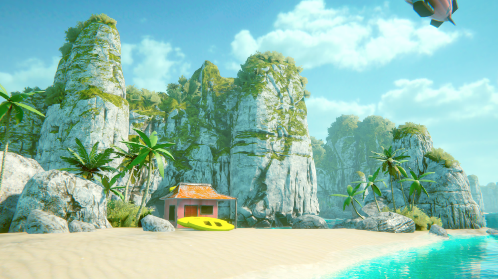
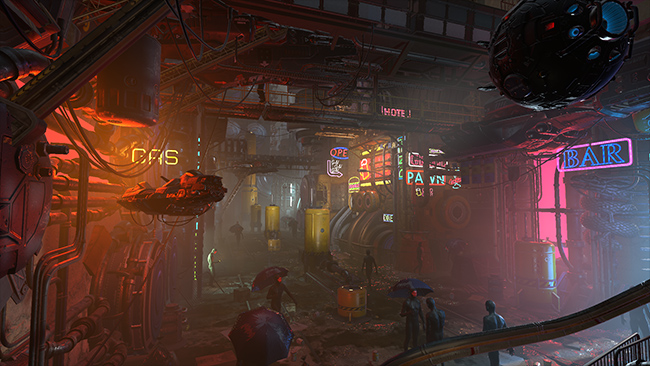
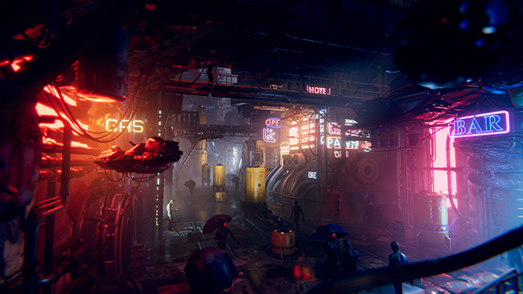
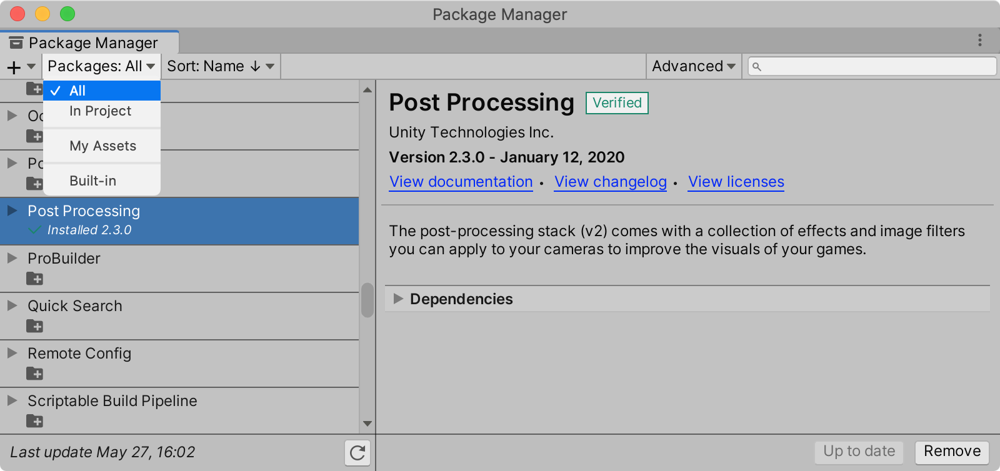
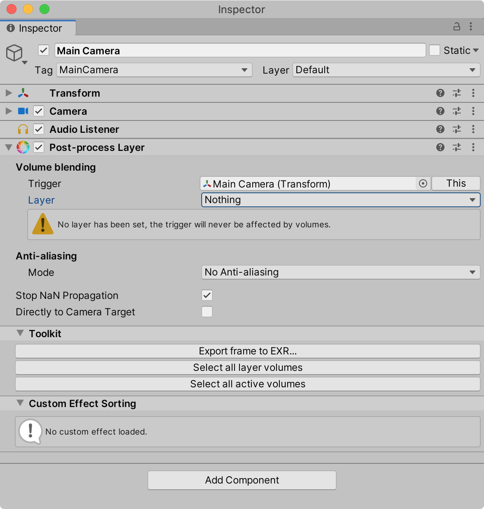
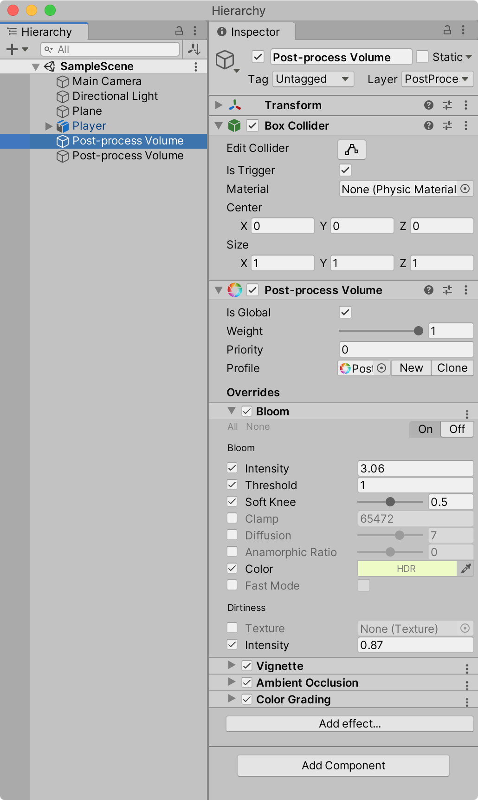
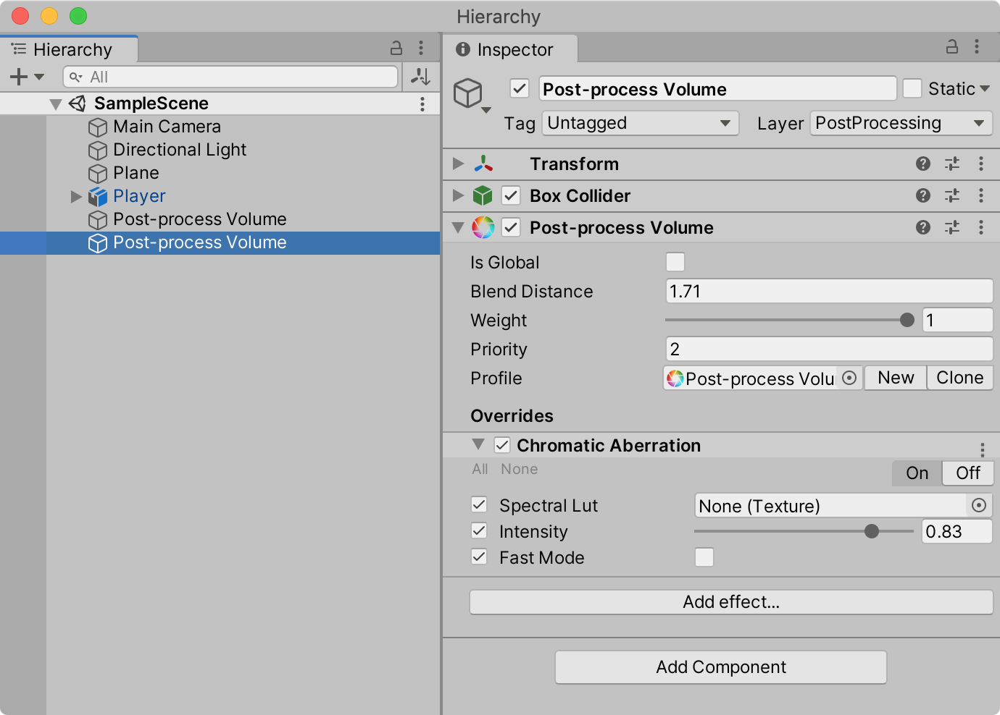

{:width="800"}

### 포스트 프로세싱(Post-processing) 이란?

직역한다면 **후처리 작업**이라고 말할 수 있다. 카메라가 촬영한 영상(이미지)을 스크린에 송출(출력)하기 전에 다양한 **필터**와 **효과**를 적용하는 기술을 말한다. 즉, 카메라로 촬영한 후에 처리한다는 의미에서 붙여진 용어라 볼 수 있으며 다음과 같은 장점과 단점을 갖는다.

- 비주얼 퀄리티을 획기적으로 증가 시킬 수 있다.
- 현실 세계의 카메라와 필름의 효과를 표현할 수 있다.
- 랜더링 퍼포먼스를 고려해 적절히 적용해야 한다.

### 포스트 프로세싱 효과

다음은 포스트 프로세싱의 적용 전후 이미지다.

{:.lead}
포스트 프로세싱 적용 전 (**before**)
{:.figure}

{:.lead}
포스트 프로세싱 적용 후 (**after**)
{:.figure}

### 포스트 프로세싱 패키지 설치 - Install

Window > Package Manager 메뉴를 선택하면 다음과 같이 패키지 매니저가 오픈된다. 왼쪽 상단의 선택 메뉴에서 "All"로 변경하면 목록에서 "Post Processing"을 찾을 수 있으며 "Install" 버튼을 클릭해 설치한다. 단, HRDP 또는 URP를 설치했다면 Post Processing 패키지는 같이 설치되었을 것이다.

Post Processing의 개발 중인 기능은 다음 깃허브 주소에서 확인할 수 있다. [GitHub 리포지토리](https://github.com/Unity-Technologies/PostProcessing)

 

### 포스트 프로세싱 적용 - Quick Start

포스트 프로세싱은 다음 세가지 중요한 컴포넌트로 구성된다.

- Post Process Layer
- Post Process Volumes
- Post Process Debug
 

### Post-process Layer 컴포넌트

이 컴포넌트의 역할은 볼륨 블렌딩(Volume Blending) 기능과 포스트 프로세싱이 적용되는 레이어를 지정한다. 또한, 안티 알리아싱(Anti Aliasing) 기능도 설정할 수 있다.

씬 뷰의 Main Camera를 선택한 후 Component > Rendering > Post-process Layer 컴포넌트를 추가한다.
{:width="500"}

### Volume Blending 속성

- **Trigger** : 이 속성은 씬 뷰의 특정 위치에 있는 Post-process Volume 컴포넌트의 영역으로 진입(근처에 도착)했을 때 그 Post-process Volume에 지정된 효과와 현재 전역적으로 영향을 미치는 효과를 서로 블렌딩(겹치는)하기 위한 게임오브젝트의 Transform 컴포넌트를 연결한다. 일반적으로는 Main Camera를 연결한다. 다만, 1인칭 시점과 같은 FPS 게임의 경우에는 Main Camera를 지정해도 무난하지만 TPS 게임의 경우 카메라는 공중에 있기 때문에 Main Camera 보다는 주인공 캐릭터의 Transform을 연결해야 한다. 

- **Layer** : 볼륨 블렌딩을 위한 대상을 필터링하기 위한 레이어를 지정하는 것으로 최적화를 위해 반드시 별도의 User Layer를 지정해야 한다.

### Anti Aliasing 속성

외곽선을 부드럽게 처리하는 효과로 다음 세가지 모드를 제공한다. 각 모드에 자세한 내용은 다음 문서에서 확인할 수 있다. [Anti aliasing 효과](https://github.com/Unity-Technologies/PostProcessing/wiki/Anti-aliasing)

| Mode                                        | 특성                                                                                                                                                  |
| :------------------------------------------ | :---------------------------------------------------------------------------------------------------------------------------------------------------- |
| Fast Approximate Anti-aliasing (FXAA)       | 속도 빠름, 낮은 퀄리티                                                                                                                                |
| Subpixel Morphological Anti-aliasing (SMAA) | 속도 느림, 높은 퀄리티                                                                                                                                |
| Temporal Anti-aliasing (TAA)                | SMAA와 비슷한 속도, 더 높은 퀄리티. 일시적인 특성으로 인해 고대비 영역(High Contrast)에서 빠르게 움직이는 물체에 고스트(ghost) 현상이 발생할 수 있다. |

### Stop NaN Propagation 속성

포스트 프로세싱이 적용되기 이전에 유효하지 않거나 NaN(Not a Number:숫자가 아닌 값)인 픽셀을 검정색으로 강제로 변경하는 속성이다. 따라서, 유효하지 않은 데이터로 인해 잘못된 후처리 효과 결과를 보정하는 역할을 하는 것으로 체크하는 것을 권장한다.

 

## Post-process Volume 컴포넌트

로컬 또는 전역으로 적용될 다양한 후 처리 작업을 하는 컴포넌트로 별도의 게임오브젝트에 추가하는 것이 바람직하다. Post-process Volume 컴포넌트를 추가하는 방식은 다음과 같다.

- 빈 게임오브젝트를 생성한 후 메뉴 Component > Rendering > Post-process Volume을 선택
- 메뉴 GameObject > 3D Object > Post-process Volume을 선택

두 번째로 방식으로 생성한 Post-process Volume에는 Box Collider가 포함돼있다. 이것은 Volume Blending의 Trigger와 충돌을 판단하는데 사용된다. 또한, 포스트 프로세싱에 사용할 Layer도 Main Camera에 지정했던것과 동일하게 지정해야 한다.

{:width="500"}

### Is Global 속성

이 속성을 체크하면 글로벌, 언체크하면 로컬 모드로 토글된다.
- 글로벌 : 전역적으로 효과가 반영
- 로컬 : Blend Distance 범위에 Trigger에 정의된 객체가 충돌했을 때 효과가 블렌딩 된다. 이때 Weight 속성에 따라 블렌딩되는 정도를 설정할 수 있으며, Priority 속성으로 Post-process Volume간의 우선 순위를 설정한다.(숫자가 높을 수록 우선 순위가 높다.)

효과를 추가하기 위해서는 Post-process Profile 에셋을 생성해야 한다. `New` 버튼을 클릭해 새로 생성하거나 `Clone` 버튼으로 기존 프로파일을 복사할 수 있다.

### 지원하는 효과

`Add Effect...` 버튼을 클릭해 원하는 효과를 추가할 수 있다. 현재 지원하는 효과는 다음과 같다.

- [Ambient Occlusion](https://github.com/Unity-Technologies/PostProcessing/wiki/Ambient-Occlusion)
- [Anti-aliasing](https://github.com/Unity-Technologies/PostProcessing/wiki/Anti-aliasing)
- [Auto Exposure](https://github.com/Unity-Technologies/PostProcessing/wiki/Auto-Exposure)
- [Bloom](https://github.com/Unity-Technologies/PostProcessing/wiki/Bloom)
- [Chromatic Aberration](https://github.com/Unity-Technologies/PostProcessing/wiki/Chromatic-Aberration)
- [Color Grading](https://github.com/Unity-Technologies/PostProcessing/wiki/Color-Grading)
- ~~[Deferred Fog](https://github.com/Unity-Technologies/PostProcessing/wiki/Deferred-Fog)~~
- [Depth of Field](https://github.com/Unity-Technologies/PostProcessing/wiki/Depth-of-Field)
- [Grain](https://github.com/Unity-Technologies/PostProcessing/wiki/Grain)
- [Lens Distortion](https://github.com/Unity-Technologies/PostProcessing/wiki/Lens-Distortion)
- [Motion Blur](https://github.com/Unity-Technologies/PostProcessing/wiki/Motion-Blur)
- [Screen-space Reflections](https://github.com/Unity-Technologies/PostProcessing/wiki/-Screen-space-Reflections)
- [Vignette](https://github.com/Unity-Technologies/PostProcessing/wiki/Vignette)

### 참고

- [유니티 공식 블로그](https://unity3d.com/kr/how-to/set-up-post-processing-stack#para3)