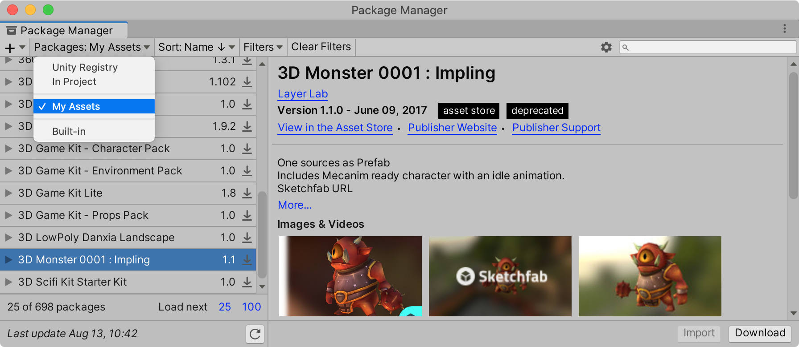
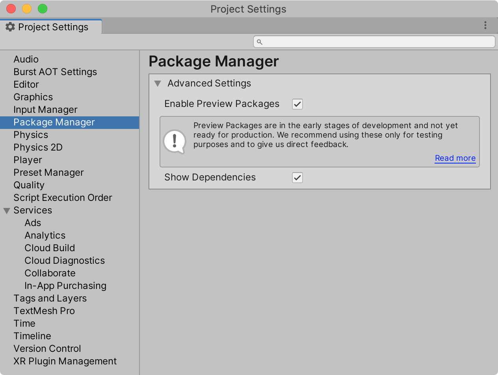
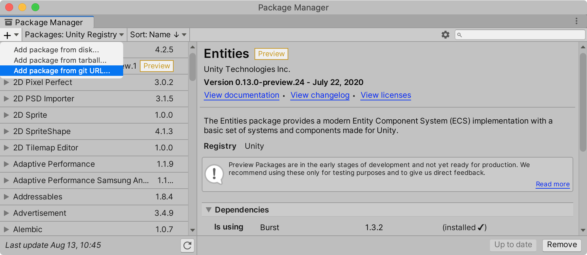
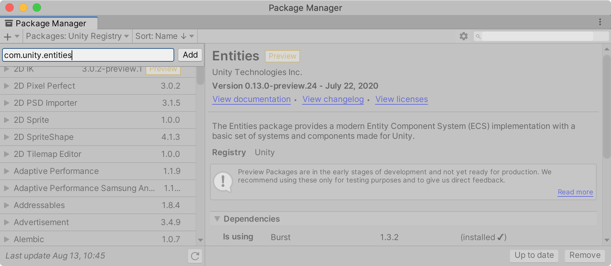

{:width="800"}

### 에셋스토어 뷰의 통합

- 유니티 2020 버전부터는 에셋스토어에서 구매한 에셋들을 Package Manager에서 직접 다운로드 및 임포트할 수 있다.
- 기존 에셋스토어 뷰(Ctrl+9, Cmd+9)에서는 더 이상 검색 및 다운로드할 수 없으며, 웹 브라우저로 연결되는 버튼을 표시한다. 이는 임베디드 브라우저의 퍼포먼스를 이유로 변경되었다고 한다. 따라서 유니티 2020 버전부터는 일반 웹 브라우저를 통해 에셋을 검색하고 구매해야한다. 구매한 에셋은 유니티 Package Manager의 Packages: 옵션을 `My Assets`으로 변경해 해당 에셋을 다운로드 할 수 있다.

{:width="800"}
<!--more-->


### Preview Package 표시 및 In Development Package 목록제외

- 프리뷰 패키지의 표시는 메뉴 `Project Settings...`에 `Package Manager` 섹션에서 `Enable Preview Packages` 옵션을 체크해야 볼 수 있다. 물론 Package Manager의 `톱니바퀴` 아이콘을 클릭하면 바로 `Project Settings...` 뷰가 오픈된다.

{:width="600"}


- 아직 공개하기 이른 Preview 패키지의 경우 `Enable Preview Packages` 옵션을 활성화 해도 Package Manager의 목록에서 보이지 않는다. 예를 들어 유니티 DOTS 기능을 사용하기 위한 Entity 패키지가 목록에 표시되지 않아 직접 추가해야한다.(유니티 2020.1.0 기준)
- Package Manager 뷰의 `+` 아이콘을 클릭한 후 `Add package from git URL`을 클릭해서 `com.unity.entities`를 입력하면 해당 패키지가 설치된다.

{:width=800}

{:width=800}

### In Development Package 목록

다음은 Package Manager에서 표시되지 않는 Preview Package(In Development Package) 목록으로 필요한 패키지는 직접 수동으로 설치할 수 있다.

```
com.ptc.vuforia.engine
com.unity.2d.entities
com.unity.ai.planner
com.unity.aovrecorder
com.unity.assetbundlebrowser
com.unity.assetgraph
com.unity.barracuda
com.unity.barracuda.burst
com.unity.build-report-inspector
com.unity.cloud.userreporting
com.unity.collections
com.unity.connect.share
com.unity.dots.editor
com.unity.entities
com.unity.film-tv.toolbox
com.unity.google.resonance.audio
com.unity.immediate-window
com.unity.mathematics
com.unity.meshsync
com.unity.multiplayer-hlapi
com.unity.package-manager-doctools
com.unity.package-manager-ui
com.unity.package-validation-suite
com.unity.physics
com.unity.platforms
com.unity.platforms.android
com.unity.platforms.linux
com.unity.platforms.macos
com.unity.platforms.web
com.unity.platforms.windows
com.unity.playablegraph-visualizer
com.unity.render-pipelines.lightweight
com.unity.rendering.hybrid
com.unity.renderstreaming
com.unity.scene-template
com.unity.simulation.client
com.unity.simulation.core
com.unity.simulation.capture
com.unity.simulation.games
com.unity.standardevents
com.unity.streaming-image-sequence
com.unity.test-framework.performance
com.unity.tiny.all
com.unity.transport
com.unity.upm.develop
com.unity.vectorgraphics
com.unity.webrtc
com.unity.xr.googlevr.android
com.unity.xr.googlevr.ios
com.unity.xr.legacyinputhelpers
com.unity.xr.oculus.android
com.unity.xr.oculus.standalone
com.unity.xr.openvr.standalone
com.unity.xr.arsubsystems
com.unity.xr.interactionsubsystems
com.unity.xr.windowsmr.metro
```


### 참고

- [유니티 포럼](https://forum.unity.com/threads/visibility-changes-for-preview-packages-in-2020-1.910880/)
- [유니티 블로그](https://blogs.unity3d.com/2020/06/24/package-manager-updates-in-unity-2020-1/?_ga=2.39137891.1712226532.1597047198-798482210.1595986036)