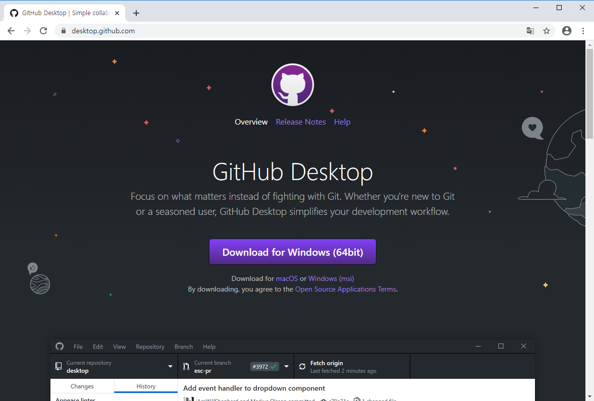
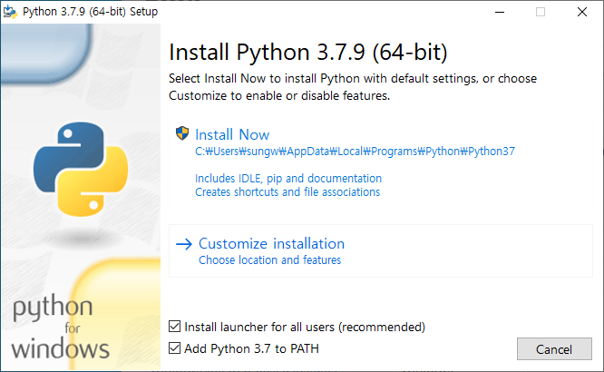
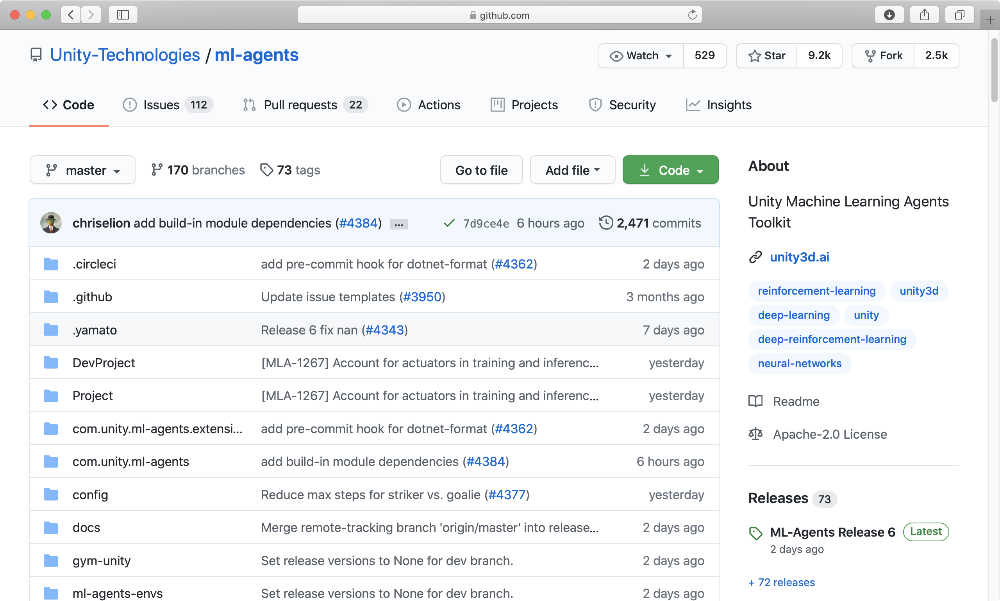
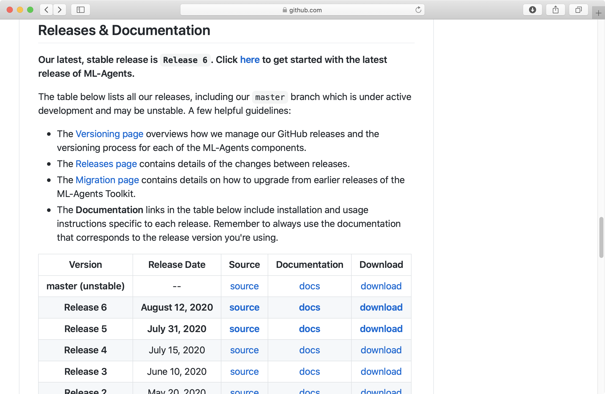
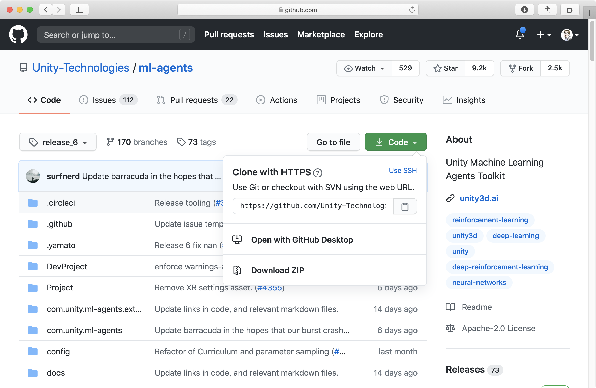
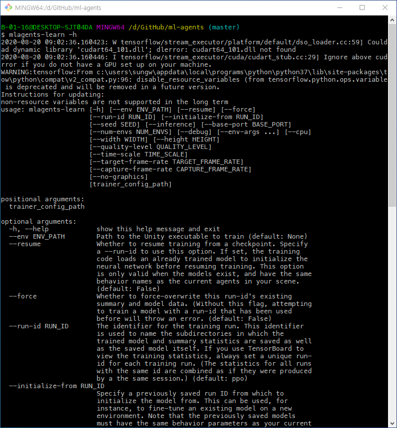

윈도우 OS에서 ML-Agents 개발환경 설정은 다음과 같이 순서로 구축한다.

- [Git 설치](https://www.git-scm.com)
- [Github Desktop 설치(옵션)](https://desktop.github.com)
- [Python 설치(3.7.x 버전, 64bit)](https://www.python.org)
- [ML-Agents 리포지토리 클론](https://github.com/Unity-Technologies/ml-agents)
- ml-agents 파이썬 패키지 설치
- 유니티 프로젝트 생성 및 ML-Agents 패키지 설치

### Git 설치
Git은 반드시 설치해야 하는 것은 아니지만 유니티는 ML-Agents 관련 샘플 프로젝트와 파이썬 패키지를 깃허브 리포지토리에서 관리하고 있기 때문에 Git을 설치하는 것이 개발시 편리하다. 윈도우 OS 사용자는 Git을 직접 설치해야 한다. 다음 주소에서 Git 설치 파일을 다운로드 후 설치한다.

- [https://www.git-scm.com](https://www.git-scm.com)

    

    <!-- <p align="left">
    
    </p> -->

<br>

### Github Desktop 설치 (옵션) 
Git 사용법이 익숙하지 않은 개발자라면 `Github Desktop`과 같은 툴을 설치하면 편리하게 사용할 수 있다.

- [https://desktop.github.com](https://desktop.github.com)
    
    
    <!-- <p align="left">
    
    </p> -->

<br>

### Python 설치
ML-Agents 1.0.3 버전에서 사용하는 파이썬은 3.7.x , 64bit 버전을 사용한다. 다음 주소에 접속해 해당 버전의 파이썬을 설치한다.
- [파이썬 공식 사이트(https://www.python.org)](https://www.python.org)
- [3.7.x 버전 다운로드(https://www.python.org/downloads/release/python-379/)](https://www.python.org/downloads/release/python-379/)
- 설치 파일을 실행했을 때 첫 화면에서 `Add Python 3.7 to Path` 체크 박스를 반드시 선택해야 한다. 만약 체크하지 않고 설치를 진행했다면 수동으로 윈도우 환경설정을 해야 하기 때문에 삭제 후 재설치하는 것이 편리하다.

    
    <!-- <p align="left">
    
    </p> -->

- 설치 완료된 후 명령 프롬프트 또는 GitBash와 같은 CLI 환경에서 `python --version` 명령어를 입력했을 때 설치 버전이 뜬다면 정상 설치된 것이다.
  ```cs
  $ python --version
  Python 3.7.9
  ```

### ML-Agents 리포지토리 클론
유니티 ML-Agents 리포지토리를 로컬 PC로 클론하기 위해 다음 주소로 접속한다.

- [https://github.com/Unity-Technologies/ml-agents](https://github.com/Unity-Technologies/ml-agents)
  
  
<br>

- 여기서 `Code` 버튼을 클릭하면 마스터 브렌치를 다운로드하기 때문에 최신 릴리스 버전을 받기 위해 아래쪽에 있는 `Release & Documantaion`에서 `Release 6`의 `Source`를 선택한다. (2020-08-30 시점)
  
  
<br>
- `Release 6` 리포지토리를 선택한 후 `Code` 버튼을 클릭해 `Open with Github Desktop`을 선택하면 GitHub Desktop이 열린다. 해당 리포지토리를 저장할 Local Path를 지정하고 클론한다.
  
  
<br>
- GitBash 또는 명령 프롬프트에서 클론하기 위해서는 클론할 폴더까지 이동한 후 다음과 같은 명령어로 클론한다.
  
  ```sh
  git clone --branch release_6 https://github.com/Unity-Technologies/ml-agents.git
  ```

### ml-agents, ml-agents-envs 패키지 설치

ML-Agents 최신 릴리스 버전의 리포지토리의 클론이 완료된 후 터미널에서 ml-agents 폴더 안으로 이동해 다음과 같이 ML-Agents 관련한 파이썬 패키지를 설치한다.

```bash
$ cd ml-agents
$ pip install -e ml-agents-envs
$ pip install -e ml-agents
```

### ML-Agents 파이썬 패키지 설치확인

명령 프롬프트에서 `mlagents-learn -h` 명령어를 입력했을 때 다음과 같이 파라메터 사용법이 표시된다면 정상적으로 설치된것을 의미한다.

```sh
$ mlagents-learn -h
```



<div id="disqus_thread"></div>
<script>
    /**
    *  RECOMMENDED CONFIGURATION VARIABLES: EDIT AND UNCOMMENT THE SECTION BELOW TO INSERT DYNAMIC VALUES FROM YOUR PLATFORM OR CMS.
    *  LEARN WHY DEFINING THESE VARIABLES IS IMPORTANT: https://disqus.com/admin/universalcode/#configuration-variables    */
    /*
    var disqus_config = function () {
    this.page.url = PAGE_URL;  // Replace PAGE_URL with your page's canonical URL variable
    this.page.identifier = PAGE_IDENTIFIER; // Replace PAGE_IDENTIFIER with your page's unique identifier variable
    };
    */
    (function() { // DON'T EDIT BELOW THIS LINE
    var d = document, s = d.createElement('script');
    s.src = 'https://unity3dstudy-hexo.disqus.com/embed.js';
    s.setAttribute('data-timestamp', +new Date());
    (d.head || d.body).appendChild(s);
    })();
</script>
<noscript>Please enable JavaScript to view the <a href="https://disqus.com/?ref_noscript">comments powered by Disqus.</a></noscript>