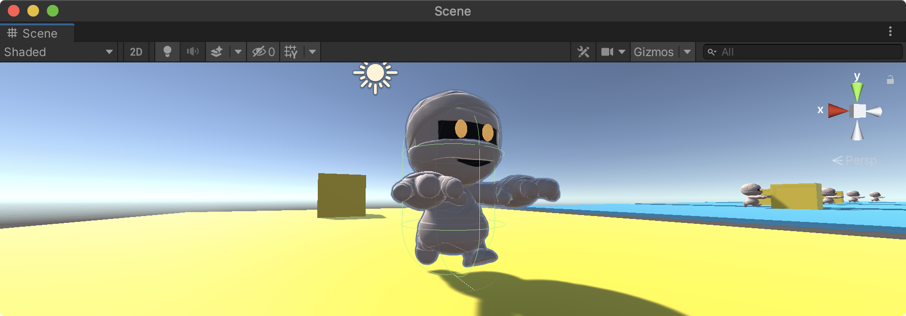
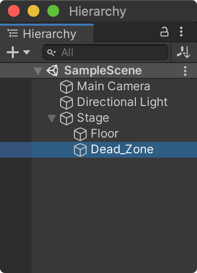
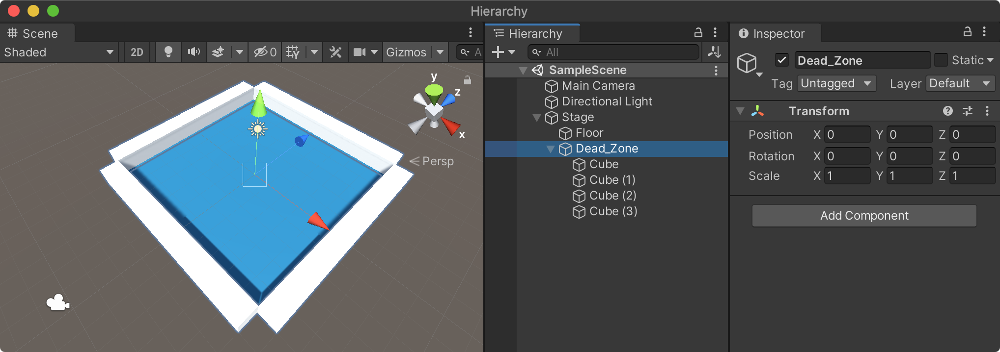

## 프로젝트 개요

머신러닝(강화학습)이 처음이거나 막 공부를 시작한 유니티 개발자의 경우 유니티 ML-Agents 패키지를 설치하고나서 샘플 프로젝트를 바로 분석하기란 상당히 어렵다. 따라서, 본 포스팅에서 소개하는 프로젝트는 필자가 진행하는 오프라인 강의 내용으로서 ML-Agents의 기본적인 컴포넌트의 사용법과 훈련방법을 익힐 수 있도록 빈 프로젝트 부터 차근차근 진행하고자 한다. 

제작할 프로젝트는 에이전트가 특정 타겟까지 이동해 취득하는 것을 간단한 학습하는 예제이다.

## 개발 환경설정

프로젝트를 진행하기 이전에 먼저 파이썬과 텐서플로 및 추가적인 파이썬 패키지가 설치되어야 한다. 아직 개발환경이 설정이 되지 않았다면 다음 문서를 참조해 자신에 맞는 개발 환경을 설정하고 진행한다.
- [ML-Agents 윈도우 OS 개발환경 구축](https://unity3dstudy.com/2020/08/20/MLAgents-Installation-for-WinOS/)
- [ML-Agents 맥 OS 개발환경 구축](https://unity3dstudy.com/2020/05/13/MLAgents-Installation-for-macOS/)

<!--more-->

## 유니티 프로젝트 생성 및 초기 설정

- 유니티를 오픈하고 새로운 프로젝트를 생성한다. 프로젝트 명은 **MummyBasic**으로 한다.(또는, 적절히 지정한다.)
- 메뉴 `Window -> Package Manager`를 선택해 **패키지매니저**를 오픈한다. 패키지매니저의 기본 조회 옵션은 현재 프로젝트에 설치된 패키지만 표시하도록 되어 있다면 `Packages:In Project`를 클릭해 `Unity Registry`로 변경하면 유니티에 등록된 다양한 패키지가 목록에 표시된다.
  
  

- 검색 입력항목에 `ML Agents`로 검색하면 `ML Agents`가 표시된다. 아래쪽의 `Install` 버튼을 클릭해 해당 패키지를 설치한다.
  
  

- `ML Agents` 패키지가 설치됐으면 프로젝트 뷰의 Packages에 다음과 같이 확인할 수 있다.
  
  {:width="250"}

## 리소스 다운로드

에이전트에 사용할 캐릭터를 에셋스토어에서 다운로드 받는다. 유니티 2020.1.x 부터는 웹브라우저에서 [유니티 에셋스토어](https://assetstore.unity.com)에 접속한 후 검색 및 구매하도록 변경됐다. `Mummy`로 검색해 다음 캐릭터를 구매(무료)한다. 

  

구매한 에셋은 유니티 패키지 매니저에서 다운로드 및 설치할 수 있다.

  

설치가 완료된 후 프로젝트 뷰에 생성된 amusedART 폴더를 05.Models로 폴더의 이름을 변경한다.

  {:width="250"}

## 학습 환경(Trainning Environment) 구축

### 바닥 생성

에이젼트가 타겟을 향해 이동하는 바닥을 생성한다. 바닥은 큐브의 스케일을 변경해 만드며 적절한 색상을 지정한다.

- 빈 게임오브젝트를 생성한 후 이름을 **Stage**로 변경한다. Stage 게임오브젝트 하위에 큐브를 추가하고 이름을 **Floor**로 지정한다.
- Floor의 Transform의 Scale 속성을 (10, 0.1, 10)으로 설정한다.
  {:width="400"}

- 프로젝트 뷰의 05.Models 폴더 하위에 Materials 폴더를 생성해 바닥에 적용할 머티리얼을 생성하고 Floor 게임오브젝트에 머티리얼을 연결한다.
  

### 외곽 영역 생성

에이전트가 바닥의 외곽으로 같을 때 충돌을 감지하기 위한 콜라이더를 생성한다. 물론 바닥을 지나쳐 밑으로 떨어지는 것을 감지해도 좋지만 여기서는 외곽 부분에 충돌하는 것으로 설정한다.

- Stage 하위에 빈 게임오브젝트를 생성하고 이름을 **Dead_Zone**으로 지정한다.
  
  {:width="250"}

- Dead_Zone 하위에 Cube를 생성하고 Transform Scale 속성을 (10, 1, 1)로 설정한다. 생성한 Cube의 위치는 Floor 외곽선 부분으로 이동한다. 이때 Vertex Snapping(단축키 V) 기능을 활용하면 편리하게 스내핑시킬 수 있다.

  

- Cube를 복제(Ctrl+d, Cmd+d)해 Floor의 나머지 3군데에도 다음 그림과 같이 배치한다.
  
  

- 복제한 Cube의 MeshRenderer 컴포넌트를 비활성화시켜 시각적으로 표시되지 않도록 변경한다.

  

- 새로운 태그 **DEAD_ZONE**을 생성하고 4개의 Cube에 지정한다.

  

### 목표물 생성

Cube를 생성해 에이젼트가 가야할 목표물로 사용한다. 역시 Stage 하위에 Cube를 만들고 이름을 Target으로 지정한다. 또한, 새로운 머티리얼을 생성해 적절한 색상으로 지정한다.

- 생성한 Target의 Transform Position은 (0, 0.55, 0)으로 지정해 바닥에 정확히 닿도록 설정한다.

  

- 새로운 태그 **TARGET**를 생성해 Target 게임오브젝트의 Tag로 지정한다.

  

### 에이젼트 캐릭터 생성

- 프로젝트 뷰의 05.Models/Mummy_Mon 폴더에 있는 Mummy_Mon 모델을 Stage 하위로 드래그 앤드 드롭해 추가한다. 만약 Material이 끊어진 경우에는 05.Models/Mummy_Mon/Materials 폴더에 있는 머티리얼을 연결한다.

  

- Stage 하위에 추가한 Mummy_Mon의 이름을 Agent로 변경하고 진행한다. Agent의 초기 위치는 Floor에 정확히 닿도록 다음과 같이 설정한다.

  - Transform Position : (0, 0.05, -2)
  
  

- Agent가 다른 객체(Dead Zone, Target)에 충돌하기 위해 Capsule Collider와 Rigidbody 컴포넌트를 추가한다. Capsule Collider 속성은 다음과 같이 설정해 Agent 크기에 맞춘다.
  - Capsule Collider
  - Center : (0, 0.5, 0)
  - Radius : 0.3
  - Rigidbody : Constraints / Freeze Rotation X, Y, Z 모드 체크

  

- 추가적으로(중요하진 않지만) Agent가 이동할 때 Walk 동작을 하기 위해 Animator 컴포넌트의 Controller 속성에 **Mummy_Anim** 컨트롤러를 연결한다.

  

<noscript>Please enable JavaScript to view the <a href="https://disqus.com/?ref_noscript">comments powered by Disqus.</a></noscript>