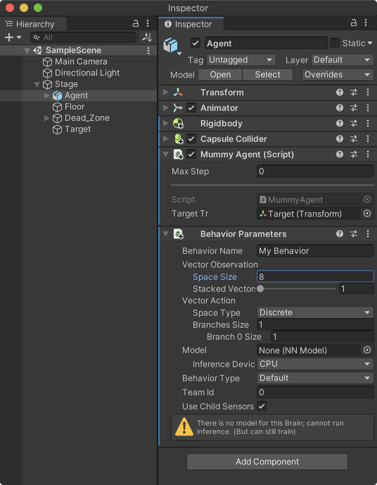
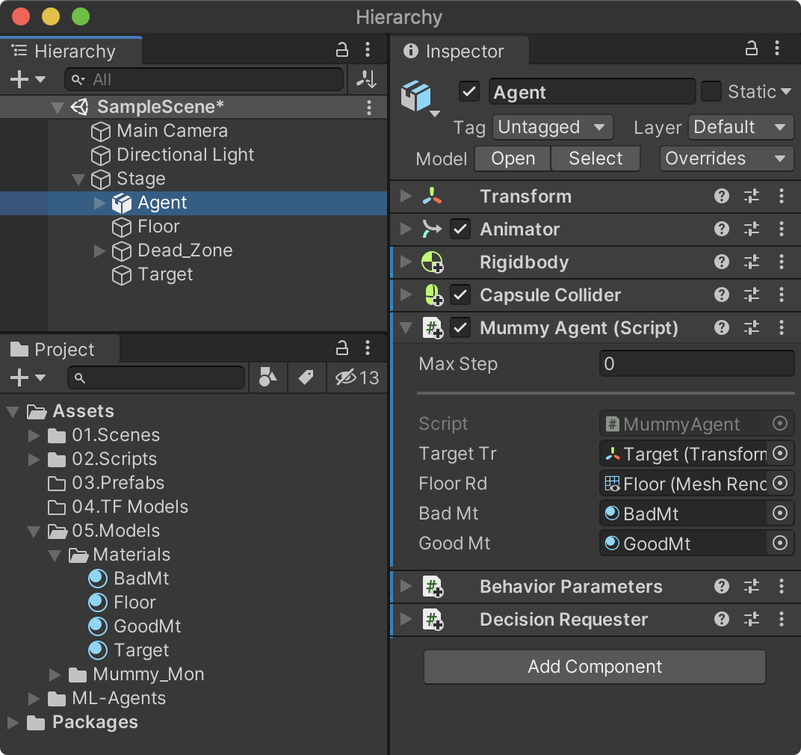
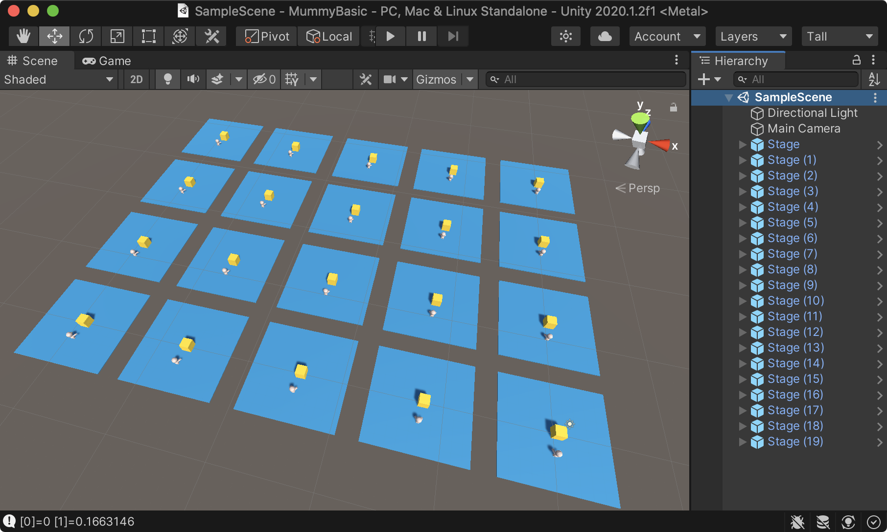

## 에에전트 구성

Agent에 추가할 스크립트를 작성해보자. 프로젝트 뷰의 02.Scripts 폴더에 C# 스크립트를 생성하고 **MummyAgent**로 스크립트 이름을 지정한다. 강화학습에 있어서 에이전트의 역할은 크게 다음과 같이 정의할 수 있다.

- 주변 환경을 관측(Observations)
- 정책에 의한 행동(Actions)
- 보상(Reward)

<br>

### 네임스페이스와 베이스 클래스

에이전트 스크립트는 `Unity.MLAgents` 네임스페이스를 지정해야하며 상속 받을 베이스 클래스를 `Agent`로 지정한다.

- using Unity.MLAgents
- Agent Class 상속
  
```cs
using UnityEngine;
using Unity.MLAgents;

public class MummyAgent : Agent
{
    
}
```

<br>

### Agent 클래스의 핵심 메소드

Agent 클래스에는 에이전트를 위한 다양한 메소드와 속성을 제공하고 있으며 Override해 사용할 수 있다. 다음 코드는 반드시 알아야 하는 기본적인 메소드를 나열한 것으로 하나씩 의미를 소개한다.

```cs
using UnityEngine;
using Unity.MLAgents;

public class MummyAgent : Agent
{
    //초기화 작업을 위해 한번 호출되는 메소드
    public override void Initialize()
    {

    }

    //에피소드(학습단위)가 시작할때마다 호출
    public override void OnEpisodeBegin()
    {

    }

    //환경 정보를 관측 및 수집해 정책 결정을 위해 브레인에 전달하는 메소드
    public override void CollectObservations(Unity.MLAgents.Sensors.VectorSensor sensor)
    {

    }

    //브레인(정책)으로 부터 전달 받은 행동을 실행하는 메소드
    public override void OnActionReceived(float[] vectorAction)
    {

    }

    //개발자(사용자)가 직접 명령을 내릴때 호출하는 메소드(주로 테스트용도 또는 모방학습에 사용)
    public override void Heuristic(float[] actionsOut)
    {

    }
}
```

<br>

### 관측 정보를 위한 변수 초기화

관측정보는 좀더 유의미한 정보를 제공해야 하기에 훈련중 모니터링을 통해 수정하는 과정을 반복해야 한다. 따라서, 개발자는 어떠한 정보를 관측해야 더 효율적인가를 고민해야 한다. Mummy 에이전트는 다음 세가지 정보를 관측하기로 하고 이에 필요한 컴포넌트를 Initialize 메소드에서 할당한다.

- Rigidbody 컴포넌트의 속도(Velocity)
- 타겟의 위치
- 자신의 위치

```cs
using UnityEngine;
using Unity.MLAgents;

public class MummyAgent : Agent
{
    private Transform tr;
    private Rigidbody rb;
    public Transform targetTr;

    //초기화 작업을 위해 한번 호출되는 메소드
    public override void Initialize()
    {
        tr = GetComponent<Transform>();
        rb = GetComponent<Rigidbody>();
    }

    [중략...]
}
```

<br>

### 학습 시작시 초기화 - OnEpisodeBegin

일반적으로 올바른 결과에 도달하던지 또는 잘못된 결과에 도달하게 되면 학습을 종료하고 새로운 학습(에피소드)를 시작한다. OnEpisodeBegin 메소드는 학습이 시작할 때 마다 한번씩 호출되는 메소드로 에이전트의 초기화 및 환경을 재설정한다.

```cs
    //에피소드(학습단위)가 시작할때마다 호출
    public override void OnEpisodeBegin()
    {
        //물리력을 초기화
        rb.velocity = Vector3.zero;
        rb.angularVelocity = Vector3.zero;

        //에이젼트의 위치를 불규칙하게 변경
        tr.localPosition = new Vector3(Random.Range(-4.0f, 4.0f)
                                     , 0.05f
                                     , Random.Range(-4.0f, 4.0f));
        targetTr.localPosition = new Vector3(Random.Range(-4.0f, 4.0f)
                                            ,0.55f
                                            ,Random.Range(-4.0f, 4.0f));
    }

```
<br>

### 에이전트 초기화 확인

여기까지 작성된 스크립트를 저장하고 하이러키 뷰의 Agent에 MummyAgent 스크립트를 추가한다. 스크립트를 추가하면 MummyAgent와 의존성이 있는 Behaviour Parameters 스크립트가 자동으로 추가된다. 물론 Behaviour Parameters를 직접 추가해도 된다.

{:width="550"}

하이러키 뷰의 Stage --> Target을 MummyAgent의 targetTr 속성으로 드래그 앤드 드롭해 연결한다.

{:width="550"}

이제 유니티를 플래이 할 때 마다 Agent와 Target의 위치가 불규칙하게 위치가 변경된다면 OnEpisodeBegin 메소드가 정상적으로 실행된 것이다.


<br>

### 관측정보 - CollectObservations

관측정보의 수집 및 전달은 CollectObservations 메소드에서 VectorSensor.AddObservation 메소드를 사용한다. AddObservation 메소드에서 넘겨주는 파라미터의 타입은 Vector 타입으로 유니티의 Vector와는 다른 개념으로 다양한 유형의 데이터를 전달할 수 있다. 여기서 중요한 것은 넘겨주는 데이터의 Size로 아래 코드에서는 AddObservation 메소드를 4번 호출했지만 각각 데이터의 Size는 3, 3, 1, 1로 총 8개의 데이터를 관측정보로 전달하는 것을 의미한다.

```cs
    //환경 정보를 관측 및 수집해 정책 결정을 위해 브레인에 전달하는 메소드
    public override void CollectObservations(Unity.MLAgents.Sensors.VectorSensor sensor)
    {
        sensor.AddObservation(targetTr.localPosition);  //3 (x,y,z)
        sensor.AddObservation(tr.localPosition);        //3 (x,y,z)
        sensor.AddObservation(rb.velocity.x);           //1 (x)
        sensor.AddObservation(rb.velocity.z);           //1 (z)
    }
```

관측 데이터의 size(갯수)인 8을 Behaviour Parameters 컴포넌트의 **Vector Observation / Space Size** 속성으로 설정한다.

- Vector Observation / Space Size 속성 : 8

{:width="550"}

<br>

### 이동처리 로직 - OnActionReceived

정책(Polocy)로 부터 결정된 행동에 대해 에이전트가 수행할 동작은 OnActionReceived 메소드에서 처리한다. 정책으로 부터 전달되는 값은 **연속적인 값(Continues)**와 **이산 값(불연속적인 값: Discrete)**로 구분한다. Mummy 에이전트는 상,하,좌,우 화살표 키입력값으로 전진,후진,좌,우로 이동 처리한다.

```cs
    //브레인으로 부터 전달받은 액션(행위)를 실행하는 메소드
    public override void OnActionReceived(float[] vectorAction)
    {
        //데이터를 정규화
        float h = Mathf.Clamp(vectorAction[0], -1.0f, 1.0f);
        float v = Mathf.Clamp(vectorAction[1], -1.0f, 1.0f);
        Vector3 dir = (Vector3.forward * v) + (Vector3.right * h);
        rb.AddForce(dir.normalized * 50.0f);

        //지속적으로 이동을 이끌어내기 위한 마이너스 보상
        SetReward(-0.001f);
    }
```

본 프로젝트에서는 정책으로 부터 결정된 VectorAction 값이 연속적인 값이기 때문에 Behaviour Parameters 의 Vector Action / Space Type 속성을 **Continue**로 지정한다. 반대로 이산 값을 사용한다면 **Discrete**로 지정해야 한다. 또한, VectorAction의 종류는 상,하 값과 좌, 우 값 2 세트이기에 **Vector Action / Space Size** 속성을 2로 설정한다.

- Vector Action / Space Type : **Continue**
- Vector Action / Space Size : **2**

{:width="550"}
<br>

### 테스트를 위한 키 입력 로직 - Heuristic

학습을 훈련시키기 이전에 미리 테스트를 해보기 위해 사용자로 부터 키보드 입력값을 받는 부분이 필요하다. 이 로직은 Heuristic 메소드에서 처리한다. 입력값의 종류는 2가지로 정의하며 `Input.GetAxis` 메소드를 사용하기에 넘어오는 값의 범위는 -1.0f ~ 0.0f ~ 1.0f 이다. 즉, 연속적인 값을 넘겨준다. 만약 `Input.GetAxisRaw` 메소드 또는 `Input.GetKeyDown`과 같은 메소드를 사용한다면 이산 값을 의미한다.

- actionsOut[0] : 왼쪽, 오른쪽 이동
- actionsOut[1] : 앞, 뒤 이동

여기서 actionsOut[0]으로 입력받은 값은 OnActionReceived 메소드의 vectorAction[0] 파라미터로 전달되며 actionsOut[1]은 vectorAction[1]로 전달되는 구조다.

- actionsOut[0] --> vectorAction[0]
- actionsOut[1] --> vectorAction[1]

```cs
    //개발자(사용자)가 직접 명령을 내릴때 호출하는 메소드(주로 테스트용도 또는 모방학습에 사용)
    public override void Heuristic(float[] actionsOut)
    {
        actionsOut[0] = Input.GetAxis("Horizontal"); //좌,우 화살표 키 //-1.0 ~ 0.0 ~ 1.0
        actionsOut[1] = Input.GetAxis("Vertical");   //상,하 화살표 키 //연속적인 값
        Debug.Log($"[0]={actionsOut[0]} [1]={actionsOut[1]}");
    }
```
<br>

### Decision Requester 컴포넌트

Decision Requester는 에이전트가 어떻게 행동해야 할지 정책에 결정을 요청하는 컴포넌트다. 정책은 에이전트가 주변 환경정보를 수집하고 관찰한 정보를 토대로 학습된것을 의미한다. 이 컴포넌트는 지속적으로 결정을 내려받아 행동해야 하는 학습 패턴의 경우 사용된다. 단, 턴제 게임과 같이 지속적인 결정이 필요없고 필요한 시점에 코드에서 직접 요청할 경우에는 추가하지 않는다.

하이러키 뷰의 Stage -> Agent를 선택하고 메뉴 **Components -> ML Agents -> Decision Requester**를 선택해 컴포넌트를 추가한다.

{:width="550"}

이제 유니티를 실행한 후 화살표 키를 입력하면 주인공 캐릭터가 상하좌우로 이동하는 것을 확인할 수 있다.

<br>

### 충돌 및 보상 처리

에이전트가 타겟에 도달했을 때 + 보상을 주고 Dead Zone 영역에 충돌하면 - 보상을 준다. 충돌 여부는 유니티의 충돌 콜백함수 (OnCollisionEnter)에서 처리한다. 다음 함수를 MummyAgent.cs 스크립트에 추가한다.

보상을 주는 메소드는 SetReward, AddReward로 두 매소드의 차이는 다음과 같다.

- SetReward() : 이전 보상값을 지우고 현재의 보상값으로 대치한다. 이는 누적된 보상값이 필요없을 경우에 사용한다.
- AddReward() : 보상을 받고 바로 에피소드가 종료시키지 않고 계속해서 학습해야 하는 환경에서 사용한다.

```cs
    void OnCollisionEnter(Collision coll)
    {
        if (coll.collider.CompareTag("DEAD_ZONE"))
        {
            //잘못된 행동일 때 마이너스 보상을 준다.
            SetReward(-1.0f);
            //학습을 종료시키는 메소드
            EndEpisode();       
        }

        if (coll.collider.CompareTag("TARGET"))
        {
            //올바른 행동일 때 플러스 보상을 준다.
            SetReward(+1.0f);
            //학습을 종료시키는 메소드
            EndEpisode();
        }
    }
```

충돌 처리시 시각적으로 성공과 실패를 알기 쉽도록하기 위해 바닥의 색상을 변경시켜보자. 다음과 같은 이름의 머티리얼을 2개 생성해 각각 다른 색상으로 지정한다.
- GoodMt : 노란색
- BadMt  : 빨간색

{:width="550"}

MummyAgent.cs 스크립트를 다음과 같이 수정한다.

```cs
using UnityEngine;
using Unity.MLAgents;

public class MummyAgent : Agent
{
    private Transform tr;
    private Rigidbody rb;

    public Transform targetTr;
    public Renderer floorRd;        //<== 추가

    //바닥의 색생을 변경하기 위한 머티리얼
    private Material originMt;      //<== 추가
    public Material badMt;          //<== 추가
    public Material goodMt;         //<== 추가

    //MLAgents 초기화 작업 - Awake/Start
    public override void Initialize()
    {
        tr = GetComponent<Transform>();
        rb = GetComponent<Rigidbody>();
        originMt = floorRd.material;  //<== 추가
    }

    [중략...]
```

하이러키 뷰의 Agent를 선택한 후 다음과 같이 3개의 속성을 연결한다.
- Floor Rd : 하이러키 뷰의 Floor
- Bad Mt : 프로젝트 뷰의 BadMt
- Good Mt : 프로젝트 뷰의 GoodMt

{:width="550"}

Target과 Dead Zone에 충돌했을 때 각각 다른 색으로 표시하기 위해 OnCollisionEnter 콜백함수를 다음과 같이 수정한다. 

```cs
    void OnCollisionEnter(Collision coll)
    {
        if (coll.collider.CompareTag("DEAD_ZONE"))
        {
            floorRd.material = badMt;       //<== 추가

            //잘못된 행동일 때 마이너스 보상을 준다.
            SetReward(-1.0f);
            //학습을 종료시키는 메소드
            EndEpisode();       
        }

        if (coll.collider.CompareTag("TARGET"))
        {
            floorRd.material = goodMt;      //<== 추가

            //올바른 행동일 때 플러스 보상을 준다.
            SetReward(+1.0f);
            //학습을 종료시키는 메소드
            EndEpisode();
        }
    }
```

바닥의 색상을 변경하고 잠시후 원래의 색상(originMt)으로 변경하기 위해 코루틴을 사용한다. 다음과 같이 RevertMaterial 코루틴 함수를 작성하고 OnEpisodeBegin에서 호출한다.

```cs
    //에피소드(학습단위)가 시작할때마다 호출
    public override void OnEpisodeBegin()
    {
        //물리력을 초기화
        rb.velocity = Vector3.zero;
        rb.angularVelocity = Vector3.zero;

        //에이젼트의 위치를 불규칙하게 변경
        tr.localPosition = new Vector3(Random.Range(-4.0f, 4.0f)
                                     , 0.05f
                                     , Random.Range(-4.0f, 4.0f));
        targetTr.localPosition = new Vector3(Random.Range(-4.0f, 4.0f)
                                            ,0.55f
                                            ,Random.Range(-4.0f, 4.0f));

        StartCoroutine(RevertMaterial());      //<== 추가                                      
    }

    IEnumerator RevertMaterial()
    {
        yield return new WaitForSeconds(0.2f);
        floorRd.material = originMt;
    }
```
<br>

### 학습을 위한 환경 복제

학습 효율을 높이기 위해 학습환경을 프리팹으로 전환시킨 후 씬에 여러개 복사한다. 다음 순서로 진행한다.

1. 하이러키 뷰의 Stage를 프로젝트 뷰 03.Prefabs로 드래그해 프리팹으로 전환
2. 하이러키 뷰의 Stage를 선택한 후 복제(Ctrl+D, Cmd+D)한 후 위치 이동
3. 위 2를 반복해 여러개를 배치

{:width="450"}



유니티를 실행한 후 화살표키를 이용해 에이젼트를 무작위로 이동시켜보고 Target에 충돌했을 때와 Dead Zone에 충돌했을 때의 다음 그림과 같이 바닥색상이 변경되고 환원되는지를 확인해보자.


강화학습을 위한 학습 환경구축은 모두 완성됐다. 다음 포스팅에서 학습을 시켜 결과를 확인해보자.

<div id="disqus_thread"></div>
<script>
    /**
    *  RECOMMENDED CONFIGURATION VARIABLES: EDIT AND UNCOMMENT THE SECTION BELOW TO INSERT DYNAMIC VALUES FROM YOUR PLATFORM OR CMS.
    *  LEARN WHY DEFINING THESE VARIABLES IS IMPORTANT: https://disqus.com/admin/universalcode/#configuration-variables    */
    /*
    var disqus_config = function () {
    this.page.url = PAGE_URL;  // Replace PAGE_URL with your page's canonical URL variable
    this.page.identifier = PAGE_IDENTIFIER; // Replace PAGE_IDENTIFIER with your page's unique identifier variable
    };
    */
    (function() { // DON'T EDIT BELOW THIS LINE
    var d = document, s = d.createElement('script');
    s.src = 'https://unity3dstudy-hexo.disqus.com/embed.js';
    s.setAttribute('data-timestamp', +new Date());
    (d.head || d.body).appendChild(s);
    })();
</script>
<noscript>Please enable JavaScript to view the <a href="https://disqus.com/?ref_noscript">comments powered by Disqus.</a></noscript>