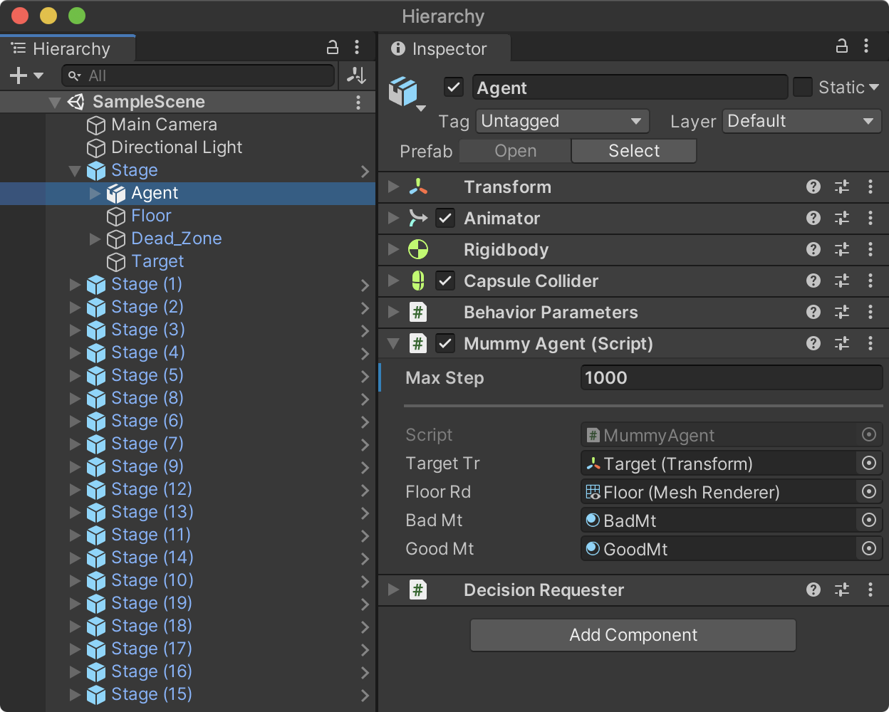
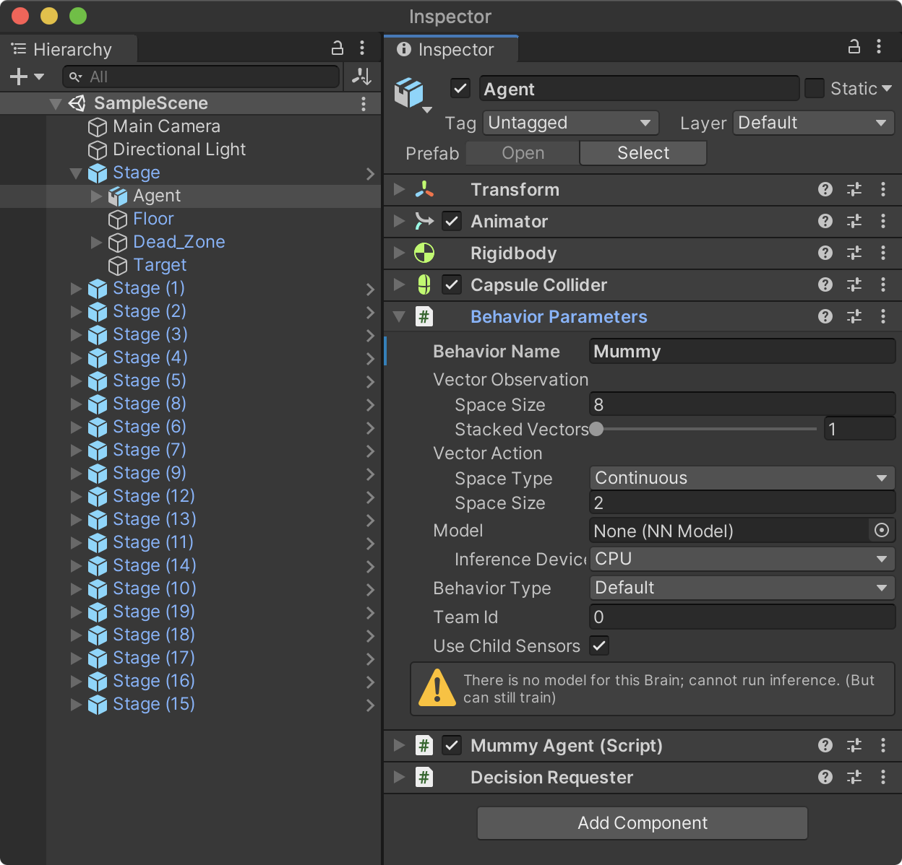
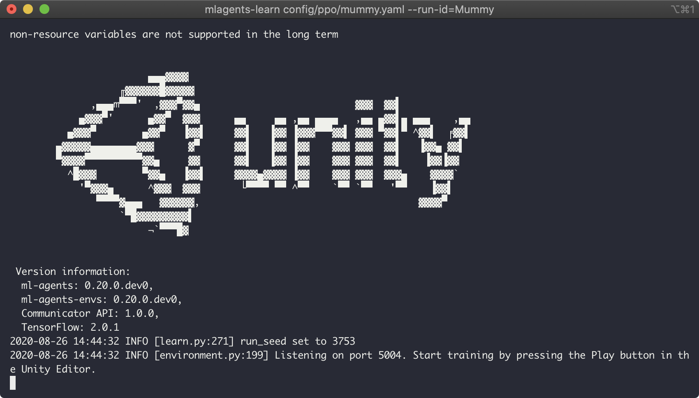
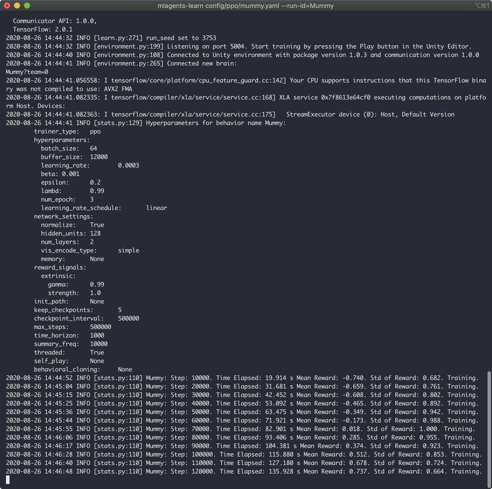
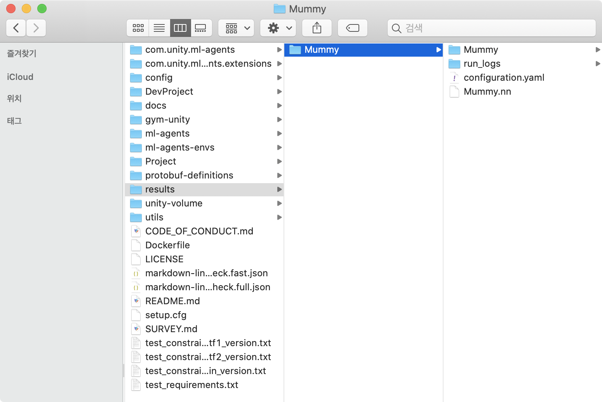
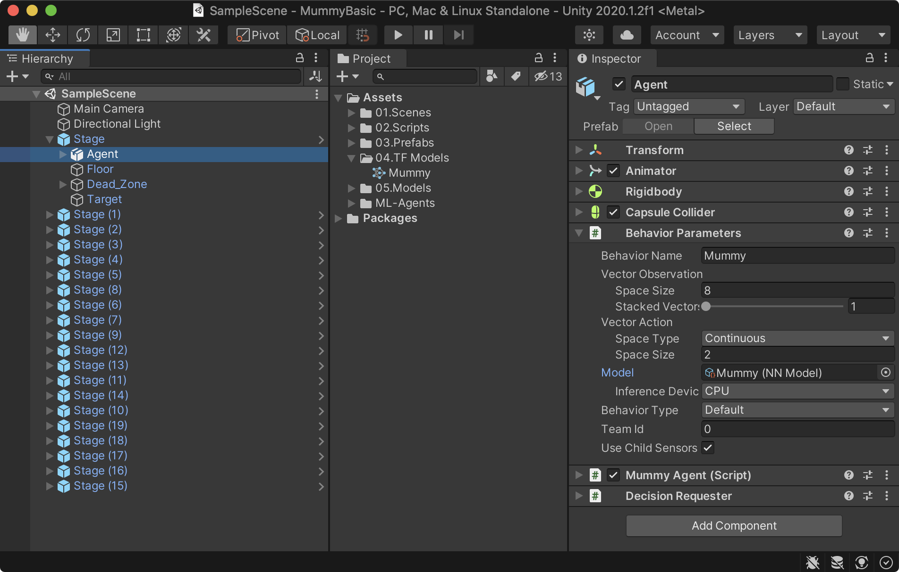

#### MaxStep 설정

Agent에 추가한 MummyAgent의 `MaxStep` 속성은 에이전트가 한 에피소드(학습단위)내에서 무작위로 액션(이동)을 시도해보는 최대 횟수를 의미한다. 이 횟수동안 액션을 취했지만 아무런 보상이 없다면 더이상 학습의 의미가 없기에 에피소드를 종료하고 다시 시작한다. `MaxStep`의 수치는 환경의 복잡도에 따라서 가장 적절한 값을 찾아야 한다. 
<!--more-->

이 프로젝트는 비교적 간단한 환경이기에 1000으로 설정한다. 만약 학습시도 횟수가 충분하지 않다고 생각된다면 더 늘려야 한다.

- Max Step : 1000

{:width="650"}

또는, 이 값은 유니티 에디터에서 직접 입력해도 되지만 `Initialize()` 함수에 다음과 같이 작성해도 된다.

```cs
    //MLAgents 초기화 작업 - Awake/Start
    public override void Initialize()
    {
        tr = GetComponent<Transform>();
        rb = GetComponent<Rigidbody>();
        originMt = floorRd.material;  //<== 추가
        
        //에피소드 별 최대 시도횟수 설정
        MaxStep = 1000;
    }
```

#### Behaviour Name 설정

Behaviour Parameters 컴포넌트의 `Behaviour Name` 속성은 환경설정 파일에서 자신의 학습환경 값을 찾기위한 속성이고 훈련이 끝난 후 해당 이름으로 모델 파일이 생성된다. **Mummy** 로 설정한 후 하이러키 뷰에 복제한 프리팹 클론에도 적용하기 위해 Agent를 선택한 후 Overrides를 클릭해 `Apply`를 클릭한다.

- Behaviour Name : Mummy

{:width="650"}

### Configuration YAML 파일 생성

학습을 위해서 먼저 YAML 설정 파일을 생성한다. 파일명은 mummy.yaml로 생성하고 ml-agents/config/ppo/ 폴더에 저장한다. 또는 해당 폴더에 있는 다른 *.yaml 파일 하나를 복사한 후 다음과 같이 설정값들을 변경해도 된다.

```yaml
behaviors:
  Mummy:
    trainer_type: ppo
    hyperparameters:
      batch_size: 64
      buffer_size: 2048
      learning_rate: 0.0003
      beta: 0.001
      epsilon: 0.2
      lambd: 0.99
      num_epoch: 3
      learning_rate_schedule: linear
    network_settings:
      normalize: true
      hidden_units: 128
      num_layers: 2
      vis_encode_type: simple
    reward_signals:
      extrinsic:
        gamma: 0.99
        strength: 1.0
    keep_checkpoints: 5
    max_steps: 200000
    time_horizon: 1000
    summary_freq: 10000
    threaded: true
```

### 학습(Training)

윈도우 사용자는 명령 프롬프트(또는 GitBash, PowerShell)를 , 맥 사용자는 터미널을 오픈한 후 ml-agents 폴더로 이동한 후 다음 명령을 입력한다.

- mlagents-learn {학습환경설정파일.yaml} \--run-id={Behaviour 명}

```sh
$ cd ml-agents
$ mlagents-learn config/ppo/mummy.yaml --run-id=Mummy
```



위와 같은 화면이 뜨면 유니티로 돌아가 실행시키면 강화학습을 시작한다. mummy.yaml의 max_steps를 200000으로 설정했기에 총 훈련의 횟수는 20만번 진행한다. 또한, summary_freq는 학습 진행중 학습 통계를 출력하는 간격으로 10000으로 설정했기에 만번 단위로 터미널에 출력한다.




학습 시작 초기의 훈련 모습 - 빨간색으로 표시되는 것이 학습 실패를 의미한다.
  


10만번 정도 진행했을 때의 훈련 모습 - 노란색이 많은것으로 보아 학습 성공률이 높다는 것을 알수 있다.
  


### 생성된 모델의 적용

20만번의 훈련이 끝나면 유니티는 자동으로 종료되며 자동으로 생성된 result 폴더 하위에 있는 Mummy.nn 파일을 유니티 프로젝트 뷰의 04.TF Models 폴더로 드래그해 임포트한다.



훈련한 학습 모델을 적용해보자. Stage -> Agent를 선택하고 임포트한 Mummy.nn 파일을 Behaviour Parameters -> Model 속성에 연결한 후 유니티를 실행하면 앞서 훈련했던 데로 Target 큐브를 향해 이동하는 에이전트 캐릭터를 확인 할 수 있을 것이다.



### 맺음말 

이 포스팅에서는 아주 단순한 환경과 로직으로 학습을 진행했지만 환경을 직접 만들면서 유니티 ML-Agents의 기본적인 기능을 소개했다. 다음 포스팅에서는 레이 캐스팅과 카메라 센서, 모방학습를 이용해 관측하는 방식으로 좀 더 복잡한 환경에서의 학습을 구현해 볼 예정이다.

<div id="disqus_thread"></div>
<script>
    /**
    *  RECOMMENDED CONFIGURATION VARIABLES: EDIT AND UNCOMMENT THE SECTION BELOW TO INSERT DYNAMIC VALUES FROM YOUR PLATFORM OR CMS.
    *  LEARN WHY DEFINING THESE VARIABLES IS IMPORTANT: https://disqus.com/admin/universalcode/#configuration-variables    */
    /*
    var disqus_config = function () {
    this.page.url = PAGE_URL;  // Replace PAGE_URL with your page's canonical URL variable
    this.page.identifier = PAGE_IDENTIFIER; // Replace PAGE_IDENTIFIER with your page's unique identifier variable
    };
    */
    (function() { // DON'T EDIT BELOW THIS LINE
    var d = document, s = d.createElement('script');
    s.src = 'https://unity3dstudy-hexo.disqus.com/embed.js';
    s.setAttribute('data-timestamp', +new Date());
    (d.head || d.body).appendChild(s);
    })();
</script>
<noscript>Please enable JavaScript to view the <a href="https://disqus.com/?ref_noscript">comments powered by Disqus.</a></noscript>